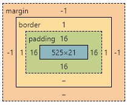
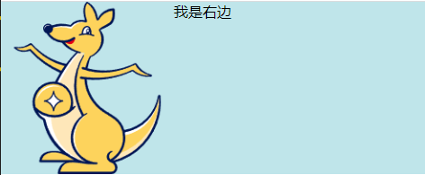

<!--
 * @Author: mengkun822 1197235402@qq.com
 * @Date: 2023-06-08 19:28:17
 * @LastEditors: mengkun822 1197235402@qq.com
 * @LastEditTime: 2023-07-10 15:41:44
 * @FilePath: \knowledge_planet\docs\md\idea-plugin\css\css基础.md
 * @Description: 这是默认设置,请设置`customMade`, 打开koroFileHeader查看配置 进行设置: https://github.com/OBKoro1/koro1FileHeader/wiki/%E9%85%8D%E7%BD%AE
-->

> ### 什么是 css

css 是 Cascading Style Sheets 简写，中文名为层叠样式表，用于网页的布局和样式定义。css 可以控制容器的大小，字体颜色大小以及位置等样式。

> ### 样式分类

1. 内联样式

```html
<div style="width: 100px;height: 100px"></div>
```

2. 内部样式

```html
<head>
    <style>
        .box {
            width: 100px;
            height: 100px;
        }
    </style>
</head>

<body>
    <div class="box"></div>
</body>
```

3. 外部样式

```html
<head>
    <style rel="stylesheet" href="../../style.css"></style>
</head>
<body>
    <div class="box"></div>
</body>
```

> ### 标签选择器的优先级

想要知道标签选择器之前得需要先知道标签选择器有哪些

1. 元素选择器：通过标签名来选择元素 例如选择所有的 span 标签

```css
span {
    color: red;
}
```

2. 通配符选择器： 使用\*选择所有的 HTML 标签

```css
* {
    padding: 0;
    margin: 0;
}
```

3. id 选择器：选择特定的类型

```html
<div id="box"></div>

<style>
    #box {
        width: 120px;
        height: 100px;
    }
</style>
```

4. class 选择器：选择特定的类型

```html
<div class="box"></div>

<style>
    .box {
        width: 120px;
        height: 100px;
    }
</style>
```

CSS 选择器有不同的优先级规则，通常按照以下顺序确定优先级从高到低：

-   !important：具有最高优先级，使用 !important 标记的样式将覆盖其他所有规则。

-   内联样式：直接应用在 HTML 元素上的样式，其优先级高于任何其他选择器。

-   ID 选择器：使用 # 开头，指定元素的唯一标识符。

-   类选择器、属性选择器和伪类选择器：使用 .、[] 或 : 开头，根据元素的类名、特定属性或状态进行选择。

-   元素选择器：使用标签名称，如 div、p 等。

> ### 定位（position）

在我们前端开发中，通常用到的定位方式是绝对定位(absolute)和固定定位(fixed)和相对向定位（relative）

1. 相对定位（relative）通常将元素相对于其他位置进行偏移来实现定位，相对定位不会影响其他的元素布局，并可以通过 top、bottom、left、right 来控制上下左右的偏移,一般默认的都是 relative 定位

```css
.box {
    position: relative;
    left: 20px;
    top: 20px;
}
```

2. 固定定位（fixed）将元素相对于浏览器进行定位,位置不会随着页滚动而改变，不影响其他元素的布局 。通过 top、bottom、left、right 来控制上下左右的偏移。

应用场景：比如弹框提示、标题栏固定、遮罩层等

```css
.box {
    position: fixed;
    left: 50%;
    top: 50%;
    transform: translate(-50%, -50%);
    width: 300px;
    height: 200px;
}
```

3. 绝对定位(absolute)将元素脱离文档流，并与相对最近的具有定位的祖先元素进行定位。

```css
.box {
    position: absolute;
    left: 300px;
    top: 200px;
}
```

> ### 什么是盒子模型？

盒子模型是指在 CSS 中，HTML 元素的每个元素都可以看作是一个矩形盒子，由内容（content）、内边距（padding）、边框（border）和外边距（margin）四个区域组成。



在盒模型中，常见的一些 bug 包括以下几种：

-   边框宽度引起的盒尺寸计算错误：在默认情况下，CSS 盒模型中的 width 和 height 属性只包括内容框的尺寸，不包括边框、内边距和外边距。但有时候设置了边框宽度时，会导致盒子的实际宽度超出了设定的宽度。可以通过使用 box-sizing: border-box; 属性来解决这个问题，将计算盒尺寸的方式修改为包括边框和内边距。

-   内联元素的上下外边距重叠：当相邻的两个内联元素具有上下外边距时，它们的外边距可能会重叠在一起，导致间距显示异常。这种情况下可以使用 display: inline-block; 或 display: block; 来消除外边距的重叠。

-   使用百分比计算的宽度和父元素的边框或内边距冲突：当一个元素的宽度使用百分比计算时，如果其父元素存在边框或内边距，会导致计算出的宽度与预期不符。这时可以考虑使用 calc() 函数来减去边框和内边距的宽度，或者使用 flex 布局或网格布局来解决这个问题。

-   浮动元素引起的高度塌陷：当父元素包含一个或多个浮动元素时，父元素的高度可能会塌陷为零，导致无法正常展示子元素。可以通过清除浮动或使用 clearfix 技术来解决高度塌陷的问题。

-   相对定位或绝对定位元素产生错位：当使用相对定位或绝对定位时，如果没有正确指定位置属性（如 top、bottom、left、right），元素可能会出现错位的情况。需要确保正确设置定位属性，以确保元素在预期位置显示。

在实际开发中，会遇到更多特定的盒模型问题，因此需具体问题具体分析，针对性地进行修复。

那么举个栗子：
边框宽度引起的盒尺寸计算错误：

```css
.box {
    width: 200px;
    height: 200px;
    border: 10px solid red;
    box-sizing: border-box;
}
```

使用 box-sizing: border-box; 来修复该 bug，确保边框宽度被包含在盒子的宽度和高度中。

内联元素的上下外边距重叠：

```css
.inline-box {
    display: inline-block;
    margin: 20px;
}
```

使用 display: inline-block; 将内联元素转换为块级元素，阻止上下外边距的重叠。

使用百分比计算的宽度和父元素的边框或内边距冲突：

```css
.parent {
    width: 300px;
    padding: 20px;
}

.child {
    width: calc(100% - 40px);
}
```

使用 calc() 函数减去父元素的边框和内边距宽度，以确保子元素的宽度计算正确。

浮动元素引起的高度塌陷：

```css
.parent::after {
    content: '';
    display: table;
    clear: both;
}
```

使用清除浮动的技术，在父元素的末尾添加一个伪元素，并设置 clear: both;，以避免高度塌陷。

相对定位或绝对定位元素产生错位：

```css
.positioned-box {
    position: relative;
    top: 20px;
    left: 50px;
}
```

> ### 什么是 BFC？

BFC（Block Formatting Context）是指块级格式化上下文，它是一个独立的渲染区域，具有一定的规则和限制。当一个元素触发 BFC 时，它会创建一个包含自身和子元素的独立渲染区域，与外部元素互不影响。

-   float 带来父元素高度塌陷问题


代码：

```html
<!DOCTYPE html>
<html lang="en">
    <head>
        <meta charset="UTF-8" />
        <meta name="viewport" content="width=device-width, initial-scale=1.0" />
        <title>BFC清除浮动</title>

        <style>
            * {
                margin: 0;
                padding: 0;
            }
            .container {
                /**
                    float浮动会造成父元素的高度塌陷
                    解决办法：在父元素的样式里面添加overflow: hidden
                */
                overflow: hidden;
                background-color: rgb(191, 229, 234);
            }
            .img {
                width: 10%;
                height: auto;
                float: left;
            }
        </style>
    </head>
    <body>
        <div class="container">
            
            <div class="right">我是右边</div>
        </div>
    </body>
</html>
```

在父元素的样式里面添加 overflow: hidden 后就可以解决父元素高度塌陷的问题

效果图：



-   BFC 解决 margin 穿透问题

相信大家在平时开发设计页面的过程中都会遇到过 margin 不起作用的情况或者是子元素的 margin 只会对父元素起作用


栗子：

```html
<!DOCTYPE html>
<html lang="en">
    <head>
        <meta charset="UTF-8" />
        <meta name="viewport" content="width=device-width, initial-scale=1.0" />
        <title>BFC 解决 margin 穿透问题</title>
    </head>
    <style>
        * {
            padding: 0;
            margin: 0;
        }
        .box1 {
            width: 100px;
            height: 100px;
            margin-bottom: 100px;
            background-color: red;
        }
        .box2 {
            width: 100px;
            height: 100px;
            margin-top: 200px;
            background-color: aqua;
        }
    </style>
    <body>
        <div class="box1"></div>
        <div class="box2"></div>
    </body>
</html>
```

解决办法：

将 box1 或者 box2 中的 div 使其成为 BFC 区域

```html
<!DOCTYPE html>
<html lang="en">
    <head>
        <meta charset="UTF-8" />
        <meta name="viewport" content="width=device-width, initial-scale=1.0" />
        <title>BFC 解决 margin 穿透问题</title>
    </head>
    <style>
        * {
            padding: 0;
            margin: 0;
        }
        .bfc {
            overflow: hidden;
        }
        .box1 {
            width: 100px;
            height: 100px;
            margin-bottom: 100px;
            background-color: red;
        }
        .box2 {
            width: 100px;
            height: 100px;
            margin-top: 200px;
            background-color: aqua;
        }
    </style>
    <body>
        <div class="bfc">
            <div class="box1"></div>
        </div>
        <div class="box2"></div>
    </body>
</html>
```

效果：


触发 BFC 的方式：

-   根元素
-   浮动元素（float 值不为 none）
-   绝对定位元素（position 值为 absolute 或 fixed）
-   display 值为 inline-block、table-cell 等的元素
-   overflow 值不为 visible 的元素
