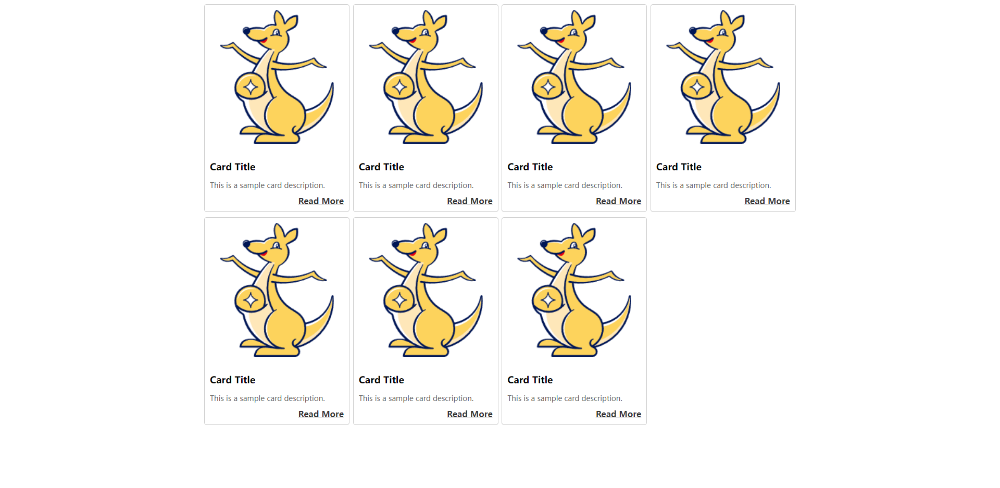

<!--
 * @Author: mengkun822 1197235402@qq.com
 * @Date: 2023-07-10 08:52:28
 * @LastEditors: mengkun822 1197235402@qq.com
 * @LastEditTime: 2023-07-10 15:35:00
 * @FilePath: \knowledge_planet\docs\md\Css\常见CSS布局.md
 * @Description: 这是默认设置,请设置`customMade`, 打开koroFileHeader查看配置 进行设置: https://github.com/OBKoro1/koro1FileHeader/wiki/%E9%85%8D%E7%BD%AE
-->

> ### 卡片布局

卡片布局是一种常用的网页布局设计，通常用于展示一组相关信息或内容，比如商品信息等

要实现卡片布局需要使用以下办法：

-   使用 html 和 css：使用 html 中 div 作为卡片的容器，然后使用 css 设置容器的样式和布局方式，比如宽高、排列方式、边框等。

-   使用 css 框架：一些流行的 css 框架，比如 bootstrap 等提桶了预定义的卡片组件等，可以使用这些卡片组件进行页面的设计和布局，快速完成页面的功能开发。

-   响应式布局： 可以使用媒体查询来使卡片布局适应在不同的系统不同分辨率下展示和布局，通过媒体查询设定的屏幕分辨率来改变 css 样式来改变卡片容器的大小

-   使用栅格系统：将页面划分为网格布局的方法，可以方便地放置和对齐卡片。

效果图：


举个栗子：

```html
<!DOCTYPE html>
<html lang="en">
    <head>
        <meta charset="UTF-8" />
        <meta name="viewport" content="width=device-width, initial-scale=1.0" />
        <title>卡片布局</title>
        <style>
            .container {
                margin: auto;
                display: flex;
                justify-content: flex-start;
                flex-wrap: wrap;
                width: 60%;
            }
            .card-box {
                width: 25%;
            }
            .card {
                width: 90%;
                border: 1px solid #ccc;
                border-radius: 5px;
                padding: 10px;
                margin: 0 auto 10px;
            }

            .card img {
                width: 100%;
                height: auto;
                border-radius: 5px;
                margin-bottom: 10px;
            }

            .card-title {
                font-size: 18px;
                margin-bottom: 5px;
            }

            .card-description {
                font-size: 14px;
                color: #666;
                margin-bottom: 10px;
            }

            .card-link {
                display: block;
                text-align: right;
                color: #333;
                font-weight: bold;
            }
        </style>
    </head>
    <body>
        <div class="container">
            <div class="card-box">
                <div class="card">
                    
                    <div class="card-content">
                        <h3 class="card-title">Card Title</h3>
                        <p class="card-description">
                            This is a sample card description.
                        </p>
                        <a href="#" class="card-link">Read More</a>
                    </div>
                </div>
            </div>
            <div class="card-box">
                <div class="card">
                    
                    <div class="card-content">
                        <h3 class="card-title">Card Title</h3>
                        <p class="card-description">
                            This is a sample card description.
                        </p>
                        <a href="#" class="card-link">Read More</a>
                    </div>
                </div>
            </div>
            <div class="card-box">
                <div class="card">
                    
                    <div class="card-content">
                        <h3 class="card-title">Card Title</h3>
                        <p class="card-description">
                            This is a sample card description.
                        </p>
                        <a href="#" class="card-link">Read More</a>
                    </div>
                </div>
            </div>
            <div class="card-box">
                <div class="card">
                    
                    <div class="card-content">
                        <h3 class="card-title">Card Title</h3>
                        <p class="card-description">
                            This is a sample card description.
                        </p>
                        <a href="#" class="card-link">Read More</a>
                    </div>
                </div>
            </div>
            <div class="card-box">
                <div class="card">
                    
                    <div class="card-content">
                        <h3 class="card-title">Card Title</h3>
                        <p class="card-description">
                            This is a sample card description.
                        </p>
                        <a href="#" class="card-link">Read More</a>
                    </div>
                </div>
            </div>
            <div class="card-box">
                <div class="card">
                    
                    <div class="card-content">
                        <h3 class="card-title">Card Title</h3>
                        <p class="card-description">
                            This is a sample card description.
                        </p>
                        <a href="#" class="card-link">Read More</a>
                    </div>
                </div>
            </div>
            <div class="card-box">
                <div class="card">
                    
                    <div class="card-content">
                        <h3 class="card-title">Card Title</h3>
                        <p class="card-description">
                            This is a sample card description.
                        </p>
                        <a href="#" class="card-link">Read More</a>
                    </div>
                </div>
            </div>
        </div>
    </body>
</html>
```

> ### 圣杯布局

圣杯布局是一种常见的网页布局方式，主要由中心内容、两边侧边栏等三个内容域构成。

特点：中心内容区域优先显示在页面中间，两边的侧边栏位于中心内容的左右两侧，可以适当灵活的调整宽度

举个栗子：

```html
<!DOCTYPE html>
<html lang="en">
    <head>
        <meta charset="UTF-8" />
        <meta name="viewport" content="width=device-width, initial-scale=1.0" />
        <title>圣杯布局</title>
    </head>
    <style>
        html,
        body {
            height: 100%;
            margin: 0;
        }

        .container {
            display: flex;
            flex-wrap: wrap; /* 让内容换行以适应高度 */
            min-height: 100vh; /* 设置容器最小高度为视口高度 */
            margin: 0 auto;
        }

        .sidebar {
            width: 200px;
            background-color: #d8f2be;
        }

        .sidebar-left {
            order: -1; /* 调整左侧边栏位置 */
        }

        .content {
            flex: 1 0 auto; /* 让主内容区域自动伸缩 */
            background-color: #fff;
        }
        .footer {
            height: 100px;
            background: 'red';
        }
    </style>
    <body>
        <div class="container">
            <div class="sidebar sidebar-left">Left Sidebar</div>
            <div class="content">Main Content</div>
            <div class="sidebar sidebar-right">Right Sidebar</div>
        </div>
        <div class="footer"></div>
    </body>
</html>
```

> ### 两栏布局

两栏布局是将页面分为左右两侧的主要区域布局

效果图：


举个栗子：

```html
<!DOCTYPE html>
<html lang="en">
    <head>
        <meta charset="UTF-8" />
        <meta name="viewport" content="width=device-width, initial-scale=1.0" />
        <title>两栏布局</title>

        <style>
            * {
                padding: 0;
                margin: 0;
            }
            .container {
                display: flex;
                height: 100vh;
            }
            .sidebar {
                width: 200px;
                background-color: aqua;
            }
            .content {
                flex-grow: 1;
                background-color: rgb(185, 178, 192);
            }
        </style>
    </head>
    <body>
        <div class="container">
            <div class="sidebar">Left Sidebar</div>
            <div class="content">Main Content</div>
        </div>
    </body>
</html>
```

> ### 水平垂直居中的办法

1. 使用 flex 布局

使用 flex 布局中的 align-items: center 和 justify-content: center 让容器居中

效果图：


举个栗子：

```html
<!DOCTYPE html>
<html lang="en">
    <head>
        <meta charset="UTF-8" />
        <meta name="viewport" content="width=device-width, initial-scale=1.0" />
        <title>flex水平垂直居中</title>
        <style>
            .container {
                display: flex;
                align-items: center;
                justify-content: center;
                height: 100vh;
            }
            .centered-content {
                height: 100px;
                width: 100px;
                background-color: aqua;
            }
        </style>
    </head>
    <body>
        <div class="container">
            <div class="centered-content"></div>
        </div>
    </body>
</html>
```

2. 绝对定位 + 负边距

通过将容器设为绝对定位，并使用 top: 50%和 left: 50%将内容块的顶部和左侧部定位在容器的中心点，然后使用 transform: translate(-50%, -50%)将内容块向左上方移动，使其居中显示。

效果图：


举个栗子：

```html
<!DOCTYPE html>
<html lang="en">
    <head>
        <meta charset="UTF-8" />
        <meta name="viewport" content="width=device-width, initial-scale=1.0" />
        <title>flex水平垂直居中</title>
        <style>
            .container {
                position: relative;
                height: 100vh;
            }
            .centered-content {
                position: absolute;
                top: 50%;
                left: 50%;
                transform: translate(-50%, -50%);
                height: 100px;
                width: 100px;
                background-color: aqua;
            }
        </style>
    </head>
    <body>
        <div class="container">
            <div class="centered-content"></div>
        </div>
    </body>
</html>
```

3. 使用表格布局

效果图：


举个栗子：

```html
<!DOCTYPE html>
<html lang="en">
    <head>
        <meta charset="UTF-8" />
        <meta name="viewport" content="width=device-width, initial-scale=1.0" />
        <title>使用表格布局</title>
        <style>
            * {
                margin: 0;
                padding: 0;
            }
            .container {
                display: table;
                width: 100%;
                height: 100vh;
            }
            .centered-content {
                display: table-cell;
                text-align: center; /* 水平居中 */
                vertical-align: middle; /* 垂直居中 */
                width: 100px;
                height: 100px;
            }
        </style>
    </head>
    <body>
        <div class="container">
            <div class="centered-content">居中内容</div>
        </div>
    </body>
</html>
```
