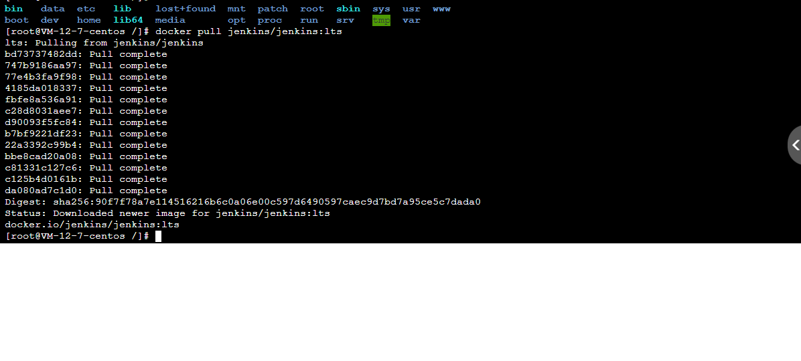

<!--
 * @Author: mengkun822 1197235402@qq.com
 * @Date: 2023-06-15 13:52:42
 * @LastEditors: mengkun822 1197235402@qq.com
 * @LastEditTime: 2023-06-15 14:13:45
 * @FilePath: \knowledge_planet\docs\md\Jenkins\Jenkins.md
 * @Description: 这是默认设置,请设置`customMade`, 打开koroFileHeader查看配置 进行设置: https://github.com/OBKoro1/koro1FileHeader/wiki/%E9%85%8D%E7%BD%AE
-->

> ### jenkins 是什么？

jenkins 是一个流行的自动化服务器，用于自动化构建、部署、测试软件项目

jenkins 提供了丰富的插件生态系统，可以帮助用户在不同平台和技术栈下轻松的构建和管理软件项目

被广泛运用在软件开发和 devOps 领域

> ### jenkins 搭建

前期准备：已购有服务器、宝塔面板、宝塔面板已经安装 docker 容器插件

开始搭建步骤：

-   用 docker 命令下载安装 jenkins

```
docker pull jenkins/jenkins:lts
```



-   创建 jenkins_home 文件夹并赋值

```
mkdir -p /jenkins_home
chown -R 1000 /jenlins_home
```

-   启动 jenkins

```
docker run -di --name=jenkins -p 8080:8080 -v /jenkins_home:/var/jenkins_home jenkins/jenkins:lts
```
