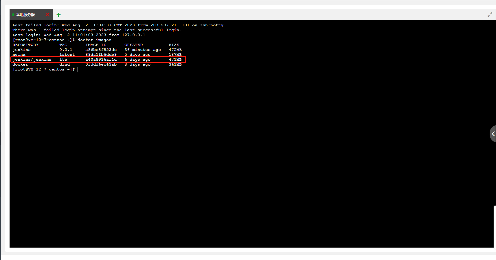

<!--
 * @Author: mengkun822 1197235402@qq.com
 * @Date: 2023-06-15 13:52:42
 * @LastEditors: mengkun822 1197235402@qq.com
 * @LastEditTime: 2023-08-03 09:55:05
 * @FilePath: \knowledge_planet\docs\md\Jenkins\Jenkins.md
 * @Description: 这是默认设置,请设置`customMade`, 打开koroFileHeader查看配置 进行设置: https://github.com/OBKoro1/koro1FileHeader/wiki/%E9%85%8D%E7%BD%AE
-->

> ### jenkins 是什么？

jenkins 是一个流行的自动化服务器，用于自动化构建、部署、测试软件项目

jenkins 提供了丰富的插件生态系统，可以帮助用户在不同平台和技术栈下轻松的构建和管理软件项目

被广泛运用在软件开发和 devOps 领域

> ### jenkins 搭建

前期准备：已购有服务器、宝塔面板

> ### 宝塔面板安装 docker 插件


> ### docker 拉取 jenkins 镜像

```dash
docker pull jenkins/jenkins:lts
```

-   查看 docker 容器下的镜像列表，查看 jenkins 镜像是否拉取成功

```dash
docker images
```



-   在首页打开 docker 管理器


-   创建容器 - 选择我们刚才下载的 jenkins 镜像 - 端口映射 将容器端口和服务器端口都填为 8080 以及对外开放端口号

        ```dash
            docker run -d -p 8080:8080 jenkins/jenkins:lts
        ```
        - 目录映射 容器目录为jenkins  服务器目录为jenkins_home

    

最后点击提交完成容器创建


-   创建站点

将指定已经解析的域名指向该站点


点击设置


添加反向代理


最后在浏览器上打开你指定的域名可以了 xxxx.com


出现此页面就代表你 docker 部署 jenkins 成功了

> ### 查看管理员密码

-   查看 docker 容器的 id

```dash
docker ps -a
```

-   登录到服务器


> ### 用 java 安装部署 jenkins

首先要先要用官网下载 jenkins.war 包，然后上传到服务器上，然后用 java 命令启动 jenkins

```dash
java -jar jenkins.war
```


这样就启动成功了，然后打开浏览器输入 ip:8080 就可以看到 jenkins 了


但是这样会存在一个缺点

java -jar jenkins.war 命令启动 jenkins 服务器，但是默认情况下，它紧紧在控制台或者终端窗口中运行，退出控制台或者终端窗口，jenkins 也就停止运行了。

所以我们需要将 jenkins 服务器的后台运行，这样即使退出终端窗口，jenkins 服务仍然在后台运行。

可以使用以下方法：

```dash
nohup java -jar jenkins.war  > jenkins.log 2>&1 &
```

这样关闭终端窗口，jenkins 仍然在后台运行
