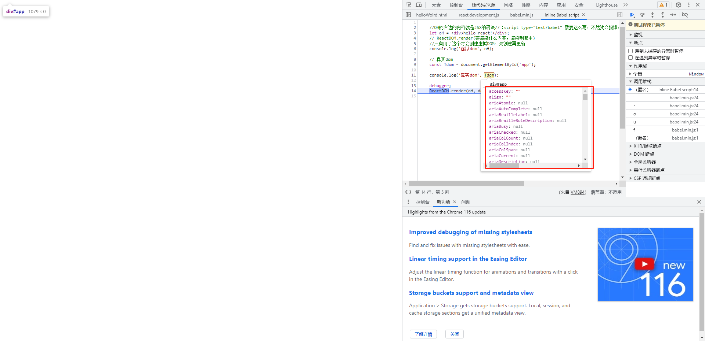

<!--
 * @Author: mengkun822 1197235402@qq.com
 * @Date: 2023-07-11 09:18:29
 * @LastEditors: mengkun822 1197235402@qq.com
 * @LastEditTime: 2023-09-02 16:37:39
 * @FilePath: \knowledge_planet\docs\md\React\React基础.md
 * @Description: 这是默认设置,请设置`customMade`, 打开koroFileHeader查看配置 进行设置: https://github.com/OBKoro1/koro1FileHeader/wiki/%E9%85%8D%E7%BD%AE
-->

> ### React 是什么？

react 是用于构建用户界面的 JavaScript 库。

-   发送请求获取数据

-   处理数据（过滤、整理格式等）

-   操作 dom 呈现页面

react 是 Facebook 开源的 js 库，用于构建 UI。2013 年宣布开源

> ### 为啥要学习 react?

1. 原生的 js 操作 dom 繁琐、效率低，浏览器会进行大量的重排重绘。

2. 原生 js 没有组件化开发，代码复用率低

3. 原生 js 没有数据驱动，代码复用率低

4. 原生 js 没有模块化，代码复用率低

5. 原生 js 没有样式隔离，代码复用率低

6. 原生 js 没有路由，代码复用率低

7. 原生 js 没有状态管理，代码复用率低

> ### react 有什么特点？

1. 声明式编码，和原生 js 一样，更容易理解、更容易维护

2. 组件化编码，提高代码复用率，提高开发效率

3. 虚拟 dom + Diffing 算法提高渲染效率

4. 单向数据流，提高代码的可维护性

5. 在 React Native 中，使用 JSX 语法，可以更方便的生成虚拟 DOM，提高渲染效率

> ### react 有什么缺点？

1. 学习成本高，需要理解 jsx、虚拟 dom、组件化编码等概念。

2. 代码冗余，react 虽然有虚拟 dom，但是还是需要理解虚拟 dom 的一些概念

3. 调试不友好

> ### 创建 hello world 程序

```html
<html lang="en">
    <head>
        <meta charset="UTF-8" />
        <meta http-equiv="X-UA-Compatible" content="IE=edge" />
        <meta name="viewport" content="width=device-width, initial-scale=1.0" />
        <title>Document</title>
        <script
            crossorigin
            src="https://unpkg.com/react@16/umd/react.development.js"
        ></script>
        <script
            crossorigin
            src="https://unpkg.com/react-dom@16/umd/react-dom.development.js"
        ></script>
        <script src="https://unpkg.com/babel-standalone@6/babel.min.js"></script>
    </head>
    <body>
        <!-- react的容器 -->
        <div id="app"></div>
    </body>
</html>
<script type="text/babel">
    //OH的右边的内容就是JSX的语法//（script type="text/babel" 需要这么写，不然就会报错，需要告诉babel需要转哪些，只需要在script标签写type="text/babel"就可以了）
    const text = <div>hello react!</div>;
    // ReactDOM.render(要渲染什么内容，渲染到哪里)
    //只有用了这个才会创建虚拟DOM，先创建再更新
    ReactDOM.render(text, document.getElementyId('#app'));
</script>
```

> ### 虚拟 dom 与真实 dom 区别

-   虚拟 dom

Vdom 本质上是 Object

将 text 打印出来，发现 VDOM 有图中的几个属性


-   真实 dom

在 console 下打印出 text 后 debugger 就可以看到真实 dom 了

```html
<html lang="en">
    <head>
        <meta charset="UTF-8" />
        <meta http-equiv="X-UA-Compatible" content="IE=edge" />
        <meta name="viewport" content="width=device-width, initial-scale=1.0" />
        <title>Document</title>
        <script
            crossorigin
            src="https://unpkg.com/react@16/umd/react.development.js"
        ></script>
        <script
            crossorigin
            src="https://unpkg.com/react-dom@16/umd/react-dom.development.js"
        ></script>
        <script src="https://unpkg.com/babel-standalone@6/babel.min.js"></script>
    </head>
    <body>
        <!-- react的容器 -->
        <div id="app"></div>
    </body>
</html>
<script type="text/babel">
    //OH的右边的内容就是JSX的语法//（script type="text/babel" 需要这么写，不然就会报错，需要告诉babel需要转哪些，只需要在script标签写type="text/babel"就可以了）
    const text = <div>hello react!</div>;
    // ReactDOM.render(要渲染什么内容，渲染到哪里)

    console.log(text);

    // 真实dom
    const Tdom = document.getElementById('app');

    console.log('真实dom', Tdom);

    //只有用了这个才会创建虚拟DOM，先创建再更新
    ReactDOM.render(text, document.getElementyId('#app'));
</script>
```



大家会看到真实 dom 比虚拟 dom 多了很多属性和方法。

所以简而言之，虚拟 dom 比真实 dom 更轻量型。

> ### JSX 语法

在 react 开发中 jsx 就是一种语法糖，react 官方并没有规定你一定要使用 jsx，但是使用 jsx 语法可以更方便的生成虚拟 dom，提高渲染。

-   语法规则：
    -   只有一个根标签
    -   标签必须有开始和结束，必须闭合
    -   定义虚拟 dom 的时候，不要用双引号
    -   标签中引入 js 表达式的时候要用{}
    -   样式的类名不要用 class 而是用 className
    -   style 内联样式要用{{}}包裹起来然后里面是 key 和 value,key 要遵循小驼峰的命名方式
    -   标签首字母
        -   开头是小写字母开头，就是普通的标签，比如 div、span、p
        -   开头是大写字母开头，就是自定义组件，比如 HelloWorld

```jsx
const name = '张三';
const VDOM = (
    <div id='box' className='boxName' style={{width: '20px';fontSize: '10px'}}>
        {name}
    </div>
);
```

> ### 组件

react 组件分为函数组件和类组件

组件的三大核心：state、props、refs

-   函数组件（简单组件）

```jsx
function HelloWorld(props) {
    return <div>hello world! {props.name}</div>;
}

ReactDOM.render(<HelloWorld name={'张三'} />, document.getElementById('app'));
```

-   类组件（复杂组件）

```jsx
class HelloWorld extends React.Component {
    render() {
        return <div>hello world!</div>;
    }
}

ReactDOM.render(<HelloWorld />, document.getElementById('app'));
```

类

在组件的 render 函数里强制绑定 this 或者在构造函数中绑定 this

```html
<html lang="en">
    <head>
        <meta charset="UTF-8" />
        <meta http-equiv="X-UA-Compatible" content="IE=edge" />
        <meta name="viewport" content="width=device-width, initial-scale=1.0" />
        <title>类组件</title>
        <script
            crossorigin
            src="https://unpkg.com/react@16/umd/react.development.js"
        ></script>
        <script
            crossorigin
            src="https://unpkg.com/react-dom@16/umd/react-dom.development.js"
        ></script>
        <script src="https://unpkg.com/babel-standalone@6/babel.min.js"></script>

        <!-- 引入 PropTypes -->
        <script src="https://cdn.jsdelivr.net/npm/prop-types@15.7.2/prop-types.min.js"></script>
    </head>
    <body>
        <!-- react的容器 -->
        <div id="app"></div>
    </body>
</html>
<script type="text/babel">
    class MyComponent extends React.Component {
        // 传参默认值
        static defaultProps = {
            name: '大白',
        };
        // 引入propTypes对组件传值类型接收和限制
        static propTypes = {
            name: PropTypes.string,
            userInfo: PropTypes.array,
            age: PropTypes.number.isRequired,
        };

        constructor(props) {
            super(props);
            this.state = {
                count: 0,
            };
            this.changeCount = this.changeCount.bind(this);
            this.startCount = this.startCount.bind(this);
        }
        render() {
            return (
                <div>
                    <div onClick={this.changeCount}>
                        我是类组件,我是被{this.props.name}点击了
                        {this.state.count}次
                    </div>
                </div>
            );
        }

        changeCount = () => {
            this.state.count++;
            this.setState({
                count: this.state.count,
            });
            this.startCount();
        };

        startCount = () => {
            this.props.init();
            console.log('开始统计了');
        };
    }

    // // 传参默认值
    // MyComponent.defaultProps = {
    //     name: '大白',
    // };
    // // 引入propTypes对组件传值类型接收和限制
    // MyComponent.propTypes = {
    //     name: PropTypes.string,
    //     userInfo: PropTypes.array,
    //     age: PropTypes.number.isRequired,
    // };

    const data = {
        name: 'zhangsan',
        userInfo: [{ name: '大白', age: 34 }],
        init: () => {
            console.log('初始化');
        },
    };
    ReactDOM.render(<MyComponent {...data} />, document.querySelector('#app'));
</script>
```

> ### 受控组件与非受控组件

-   受控组件

在 react 中受控组件指的是受 react 控制并通过 props 传递值的表单组件，在可控组件的中，可控组件的状态和输入框的值保持同步

```html
<!--
 * @Author: mengkun822 1197235402@qq.com
 * @Date: 2023-09-02 14:37:27
 * @LastEditors: mengkun822 1197235402@qq.com
 * @LastEditTime: 2023-09-02 15:11:50
 * @FilePath: \react_learning\createRef.html
 * @Description: 这是默认设置,请设置`customMade`, 打开koroFileHeader查看配置 进行设置: https://github.com/OBKoro1/koro1FileHeader/wiki/%E9%85%8D%E7%BD%AE
-->
<!DOCTYPE html>
<html lang="en">
    <head>
        <meta charset="UTF-8" />
        <meta name="viewport" content="width=device-width, initial-scale=1.0" />
        <title>非受控组件</title>

        <script
            crossorigin
            src="https://unpkg.com/react@16/umd/react.development.js"
        ></script>
        <script
            crossorigin
            src="https://unpkg.com/react-dom@16/umd/react-dom.development.js"
        ></script>
        <script src="https://unpkg.com/babel-standalone@6/babel.min.js"></script>

        <!-- 引入 PropTypes -->
        <script src="https://cdn.jsdelivr.net/npm/prop-types@15.7.2/prop-types.min.js"></script>
    </head>
    <body>
        <div id="app"></div>

        <script type="text/babel">
            class Login extends React.Component {
                state = {
                    uername: '',
                    password: '',
                };
                constructor(props) {
                    super(props);
                    this.submitForm = this.submitForm.bind(this);
                    this.usernameChange = this.usernameChange.bind(this);
                    this.passwordChange = this.passwordChange.bind(this);
                }

                submitForm = () => {
                    console.log(this.state, '----data-----');
                };

                usernameChange = (event) => {
                    this.setState({
                        uername: event.target.value,
                    });
                };

                passwordChange = (event) => {
                    this.setState({
                        password: event.target.value,
                    });
                };

                render() {
                    return (
                        <form
                            // action='https://api.mkook.xyz'
                            onSubmit={this.submitForm}
                        >
                            <span>
                                用户名：
                                <input
                                    type='text'
                                    name='username'
                                    onChange={this.usernameChange}
                                />
                            </span>
                            <span>
                                密码：
                                <input
                                    type='password'
                                    name='password'
                                    onChange={this.passwordChange}
                                />
                            </span>
                            <button>确定</button>
                        </form>
                    );
                }
            }

            ReactDOM.render(<Login />, document.getElementById('app'));
        </script>
    </body>
</html>
```

-   非受控组件

非受控组件指的是不受 react 直接控制的表单组件，在非受控组件中，表单元素的值由 dom 自身管理，非通过 react 的状态来同步。

与可控组件相比，非受控组件更多的依赖 dom 自身的行为和事件处理。用户输入的会直接修改 dom 元素的值，并且需要使用 ref 来获取表单元素的引用来访问值。

```js
import React, { useRef } from 'react';

function UncontrolledInput() {
    const inputRef = useRef(null);

    const handleSubmit = (event) => {
        event.preventDefault();
        console.log('提交的值：', inputRef.current.value);
    };

    return (
        <div>
            <form onSubmit={handleSubmit}>
                <input type='text' ref={inputRef} />
                <button type='submit'>提交</button>
            </form>
        </div>
    );
}
```

> ### react 生命周期

组件的生命周期可以分为三个阶段：挂载阶段（Mounting）、更新阶段（Updating）和卸载阶段（unmounting）

每个阶段都对应着一些生命周期方法，可以在这些方法中执行一些你需要的操作。

-   挂载阶段（Mounting）

    -   constructor(): 组件实例化时调用，用于初始化状态和绑定事件处理程序
    -   static gretDeriverdStateFromProps(): 组件实例化时调用，用于初始化状态,j 接收 props 和 state，并返回一个新的 state
    -   render(): 组件渲染时调用，用于生成虚拟 DOM，并返回一个 React 元素，该元素描述了组件的 UI 结构，渲染到页面中
    -   componentDidMount(): 组件挂载到 DOM 后调用，可以在这里做 ajax 请求，DOM 操作等

-   更新阶段（Updating）

    -   static getDerivedStateFromProps(): 组件更新时调用，用于初始化状态，接收 props 和 state，并返回一个新的 state

    -   shouldComponentUpdate():在更新前调用，判断是否需要重新渲染组件，默认返回 true

    -   render：重新渲染组件的 UI

    -   componentDidUpdate(): 组件更新完成后调用，可以在这里做 DOM 操作

-   卸载阶段（unmounting）

    -   componentWillUnmount(): 组件卸载前调用，用于清理内存等
