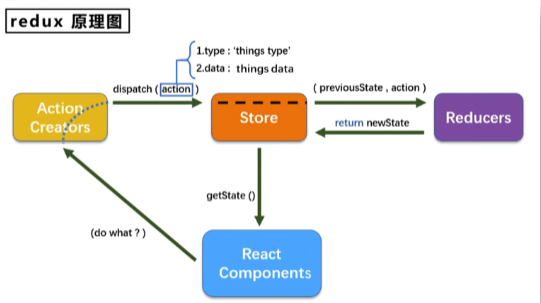

<!--
 * @Author: mengkun822 1197235402@qq.com
 * @Date: 2023-07-11 09:18:29
 * @LastEditors: mengkun822 1197235402@qq.com
 * @LastEditTime: 2023-09-14 15:17:21
 * @FilePath: \knowledge_planet\docs\md\React\React基础.md
 * @Description: 这是默认设置,请设置`customMade`, 打开koroFileHeader查看配置 进行设置: https://github.com/OBKoro1/koro1FileHeader/wiki/%E9%85%8D%E7%BD%AE
-->

> ### React 是什么？

react 是用于构建用户界面的 JavaScript 库。

-   发送请求获取数据

-   处理数据（过滤、整理格式等）

-   操作 dom 呈现页面

react 是 Facebook 开源的 js 库，用于构建 UI。2013 年宣布开源

> ### 为啥要学习 react?

1. 原生的 js 操作 dom 繁琐、效率低，浏览器会进行大量的重排重绘。

2. 原生 js 没有组件化开发，代码复用率低

3. 原生 js 没有数据驱动，代码复用率低

4. 原生 js 没有模块化，代码复用率低

5. 原生 js 没有样式隔离，代码复用率低

6. 原生 js 没有路由，代码复用率低

7. 原生 js 没有状态管理，代码复用率低

> ### react 有什么特点？

1. 声明式编码，和原生 js 一样，更容易理解、更容易维护

2. 组件化编码，提高代码复用率，提高开发效率

3. 虚拟 dom + Diffing 算法提高渲染效率

4. 单向数据流，提高代码的可维护性

5. 在 React Native 中，使用 JSX 语法，可以更方便的生成虚拟 DOM，提高渲染效率

> ### react 有什么缺点？

1. 学习成本高，需要理解 jsx、虚拟 dom、组件化编码等概念。

2. 代码冗余，react 虽然有虚拟 dom，但是还是需要理解虚拟 dom 的一些概念

3. 调试不友好

> ### 创建 hello world 程序

```html
<html lang="en">
    <head>
        <meta charset="UTF-8" />
        <meta http-equiv="X-UA-Compatible" content="IE=edge" />
        <meta name="viewport" content="width=device-width, initial-scale=1.0" />
        <title>Document</title>
        <script
            crossorigin
            src="https://unpkg.com/react@16/umd/react.development.js"
        ></script>
        <script
            crossorigin
            src="https://unpkg.com/react-dom@16/umd/react-dom.development.js"
        ></script>
        <script src="https://unpkg.com/babel-standalone@6/babel.min.js"></script>
    </head>
    <body>
        <!-- react的容器 -->
        <div id="app"></div>
    </body>
</html>
<script type="text/babel">
    //OH的右边的内容就是JSX的语法//（script type="text/babel" 需要这么写，不然就会报错，需要告诉babel需要转哪些，只需要在script标签写type="text/babel"就可以了）
    const text = <div>hello react!</div>;
    // ReactDOM.render(要渲染什么内容，渲染到哪里)
    //只有用了这个才会创建虚拟DOM，先创建再更新
    ReactDOM.render(text, document.getElementyId('#app'));
</script>
```

> ### 虚拟 dom 与真实 dom 区别

-   虚拟 dom

Vdom 本质上是 Object

将 text 打印出来，发现 VDOM 有图中的几个属性


-   真实 dom

在 console 下打印出 text 后 debugger 就可以看到真实 dom 了

```html
<html lang="en">
    <head>
        <meta charset="UTF-8" />
        <meta http-equiv="X-UA-Compatible" content="IE=edge" />
        <meta name="viewport" content="width=device-width, initial-scale=1.0" />
        <title>Document</title>
        <script
            crossorigin
            src="https://unpkg.com/react@16/umd/react.development.js"
        ></script>
        <script
            crossorigin
            src="https://unpkg.com/react-dom@16/umd/react-dom.development.js"
        ></script>
        <script src="https://unpkg.com/babel-standalone@6/babel.min.js"></script>
    </head>
    <body>
        <!-- react的容器 -->
        <div id="app"></div>
    </body>
</html>
<script type="text/babel">
    //OH的右边的内容就是JSX的语法//（script type="text/babel" 需要这么写，不然就会报错，需要告诉babel需要转哪些，只需要在script标签写type="text/babel"就可以了）
    const text = <div>hello react!</div>;
    // ReactDOM.render(要渲染什么内容，渲染到哪里)

    console.log(text);

    // 真实dom
    const Tdom = document.getElementById('app');

    console.log('真实dom', Tdom);

    //只有用了这个才会创建虚拟DOM，先创建再更新
    ReactDOM.render(text, document.getElementyId('#app'));
</script>
```


大家会看到真实 dom 比虚拟 dom 多了很多属性和方法。

所以简而言之，虚拟 dom 比真实 dom 更轻量型。

> ### JSX 语法

在 react 开发中 jsx 就是一种语法糖，react 官方并没有规定你一定要使用 jsx，但是使用 jsx 语法可以更方便的生成虚拟 dom，提高渲染。

-   语法规则：
    -   只有一个根标签
    -   标签必须有开始和结束，必须闭合
    -   定义虚拟 dom 的时候，不要用双引号
    -   标签中引入 js 表达式的时候要用{}
    -   样式的类名不要用 class 而是用 className
    -   style 内联样式要用{{}}包裹起来然后里面是 key 和 value,key 要遵循小驼峰的命名方式
    -   标签首字母
        -   开头是小写字母开头，就是普通的标签，比如 div、span、p
        -   开头是大写字母开头，就是自定义组件，比如 HelloWorld

```jsx
const name = '张三';
const VDOM = (
    <div id='box' className='boxName' style={{width: '20px';fontSize: '10px'}}>
        {name}
    </div>
);
```

> ### 组件

react 组件分为函数组件和类组件

组件的三大核心：state、props、refs

-   函数组件（简单组件）

```jsx
function HelloWorld(props) {
    return <div>hello world! {props.name}</div>;
}

ReactDOM.render(<HelloWorld name={'张三'} />, document.getElementById('app'));
```

-   类组件（复杂组件）

```jsx
class HelloWorld extends React.Component {
    render() {
        return <div>hello world!</div>;
    }
}

ReactDOM.render(<HelloWorld />, document.getElementById('app'));
```

类

在组件的 render 函数里强制绑定 this 或者在构造函数中绑定 this

```html
<html lang="en">
    <head>
        <meta charset="UTF-8" />
        <meta http-equiv="X-UA-Compatible" content="IE=edge" />
        <meta name="viewport" content="width=device-width, initial-scale=1.0" />
        <title>类组件</title>
        <script
            crossorigin
            src="https://unpkg.com/react@16/umd/react.development.js"
        ></script>
        <script
            crossorigin
            src="https://unpkg.com/react-dom@16/umd/react-dom.development.js"
        ></script>
        <script src="https://unpkg.com/babel-standalone@6/babel.min.js"></script>

        <!-- 引入 PropTypes -->
        <script src="https://cdn.jsdelivr.net/npm/prop-types@15.7.2/prop-types.min.js"></script>
    </head>
    <body>
        <!-- react的容器 -->
        <div id="app"></div>
    </body>
</html>
<script type="text/babel">
    class MyComponent extends React.Component {
        // 传参默认值
        static defaultProps = {
            name: '大白',
        };
        // 引入propTypes对组件传值类型接收和限制
        static propTypes = {
            name: PropTypes.string,
            userInfo: PropTypes.array,
            age: PropTypes.number.isRequired,
        };

        constructor(props) {
            super(props);
            this.state = {
                count: 0,
            };
            this.changeCount = this.changeCount.bind(this);
            this.startCount = this.startCount.bind(this);
        }
        render() {
            return (
                <div>
                    <div onClick={this.changeCount}>
                        我是类组件,我是被{this.props.name}点击了
                        {this.state.count}次
                    </div>
                </div>
            );
        }

        changeCount = () => {
            this.state.count++;
            this.setState({
                count: this.state.count,
            });
            this.startCount();
        };

        startCount = () => {
            this.props.init();
            console.log('开始统计了');
        };
    }

    // // 传参默认值
    // MyComponent.defaultProps = {
    //     name: '大白',
    // };
    // // 引入propTypes对组件传值类型接收和限制
    // MyComponent.propTypes = {
    //     name: PropTypes.string,
    //     userInfo: PropTypes.array,
    //     age: PropTypes.number.isRequired,
    // };

    const data = {
        name: 'zhangsan',
        userInfo: [{ name: '大白', age: 34 }],
        init: () => {
            console.log('初始化');
        },
    };
    ReactDOM.render(<MyComponent {...data} />, document.querySelector('#app'));
</script>
```

> ### 受控组件与非受控组件

-   受控组件

在 react 中受控组件指的是受 react 控制并通过 props 传递值的表单组件，在可控组件的中，可控组件的状态和输入框的值保持同步

```html
<!--
 * @Author: mengkun822 1197235402@qq.com
 * @Date: 2023-09-02 14:37:27
 * @LastEditors: mengkun822 1197235402@qq.com
 * @LastEditTime: 2023-09-02 15:11:50
 * @FilePath: \react_learning\createRef.html
 * @Description: 这是默认设置,请设置`customMade`, 打开koroFileHeader查看配置 进行设置: https://github.com/OBKoro1/koro1FileHeader/wiki/%E9%85%8D%E7%BD%AE
-->
<!DOCTYPE html>
<html lang="en">
    <head>
        <meta charset="UTF-8" />
        <meta name="viewport" content="width=device-width, initial-scale=1.0" />
        <title>非受控组件</title>

        <script
            crossorigin
            src="https://unpkg.com/react@16/umd/react.development.js"
        ></script>
        <script
            crossorigin
            src="https://unpkg.com/react-dom@16/umd/react-dom.development.js"
        ></script>
        <script src="https://unpkg.com/babel-standalone@6/babel.min.js"></script>

        <!-- 引入 PropTypes -->
        <script src="https://cdn.jsdelivr.net/npm/prop-types@15.7.2/prop-types.min.js"></script>
    </head>
    <body>
        <div id="app"></div>

        <script type="text/babel">
            class Login extends React.Component {
                state = {
                    uername: '',
                    password: '',
                };
                constructor(props) {
                    super(props);
                    this.submitForm = this.submitForm.bind(this);
                    this.usernameChange = this.usernameChange.bind(this);
                    this.passwordChange = this.passwordChange.bind(this);
                }

                submitForm = () => {
                    console.log(this.state, '----data-----');
                };

                usernameChange = (event) => {
                    this.setState({
                        uername: event.target.value,
                    });
                };

                passwordChange = (event) => {
                    this.setState({
                        password: event.target.value,
                    });
                };

                render() {
                    return (
                        <form
                            // action='https://api.mkook.xyz'
                            onSubmit={this.submitForm}
                        >
                            <span>
                                用户名：
                                <input
                                    type='text'
                                    name='username'
                                    onChange={this.usernameChange}
                                />
                            </span>
                            <span>
                                密码：
                                <input
                                    type='password'
                                    name='password'
                                    onChange={this.passwordChange}
                                />
                            </span>
                            <button>确定</button>
                        </form>
                    );
                }
            }

            ReactDOM.render(<Login />, document.getElementById('app'));
        </script>
    </body>
</html>
```

-   非受控组件

非受控组件指的是不受 react 直接控制的表单组件，在非受控组件中，表单元素的值由 dom 自身管理，非通过 react 的状态来同步。

与可控组件相比，非受控组件更多的依赖 dom 自身的行为和事件处理。用户输入的会直接修改 dom 元素的值，并且需要使用 ref 来获取表单元素的引用来访问值。

```js
import React, { useRef } from 'react';

function UncontrolledInput() {
    const inputRef = useRef(null);

    const handleSubmit = (event) => {
        event.preventDefault();
        console.log('提交的值：', inputRef.current.value);
    };

    return (
        <div>
            <form onSubmit={handleSubmit}>
                <input type='text' ref={inputRef} />
                <button type='submit'>提交</button>
            </form>
        </div>
    );
}
```

> ### react 生命周期

组件的生命周期可以分为三个阶段：挂载阶段（Mounting）、更新阶段（Updating）和卸载阶段（unmounting）

每个阶段都对应着一些生命周期方法，可以在这些方法中执行一些你需要的操作。

-   挂载阶段（Mounting）

    -   constructor(): 组件实例化时调用，用于初始化状态和绑定事件处理程序
    -   static gretDeriverdStateFromProps(): 组件实例化时调用，用于初始化状态,j 接收 props 和 state，并返回一个新的 state
    -   render(): 组件渲染时调用，用于生成虚拟 DOM，并返回一个 React 元素，该元素描述了组件的 UI 结构，渲染到页面中
    -   componentDidMount(): 组件挂载到 DOM 后调用，可以在这里做 ajax 请求，DOM 操作等

-   更新阶段（Updating）

    -   static getDerivedStateFromProps(): 组件更新时调用，用于初始化状态，接收 props 和 state，并返回一个新的 state

    -   shouldComponentUpdate():在更新前调用，判断是否需要重新渲染组件，默认返回 true

    -   render：重新渲染组件的 UI

    -   componentDidUpdate(): 组件更新完成后调用，可以在这里做 DOM 操作

-   卸载阶段（unmounting）

    -   componentWillUnmount(): 组件卸载前调用，用于清理内存等

componenetWillReceiverProps 相当于 vue 的 watch

> ### 消息订阅与发布技术

在 react 中，可以使用消息订阅与发布模式实现组件之间的通信。这种模式也被称为观察者模式

实现方式：

1. 创建一个事件中心：可以是一个独立的 JavaScript 的模块，用于管理事件的订阅和发布。

```js
// eventCenter.js
const eventCenter = {
    events: {},
    subscribe(eventName, callback) {
        if (!this.events[eventName]) {
            this.events[eventName] = [];
        }
        this.events[eventName].push(callback);
    },

    publish(eventName, data) {
        const callback = this.events[eventName];
        if (callback) {
            callbacks.forEach((callback) => callback(data));
        }
    },
};

export default eventCenter;
```

2. 需要订阅事件的组件中使用 subscribe 方法订阅事件，并定义事件处理函数。

```js
// SubsciberComponent
import React from 'react';
import eventCenter from './eventCenter';

function SubsciberComponent() {
    useEffect(() => {
        const handleEvent = (data) => {
            // 处理事件的逻辑
            console.log(data);
        };

        eventCenter.subscribe('eventName', handleEvent);

        return () => {
            eventCenter.unsubscibe('eventName', handleEvent);
        };
    }, []);
    return <div>Subscribe Component</div>;
}

export default SubscribeComponent;
```

3. 在需要发布事件的组件使用 publish 方法来发布事件，并传递需要传递的数据

```js
// PublisherComponet
import React from 'react';
import eventCenter from './eventCenter';

function PublisherComponet() {
    const handleClick = () => {
        eventCenter.publish('eventName', { message: 'hello wolrd!' });
    };
}
```

> ### 路由（react-router-dom）

-   什么是路由？

    -   路由就是一个映射关系（key:value）
    -   key 为路径，value 可能是 function 或者 component

-   内置组件
    -   BrowserRouter (history 路由)
    -   HashRouter (hash 路由)
    -   Route
    -   Redirect
    -   Link
    -   NavLink
    -   Switch

> ### 向路由组件传参

-   params 参数

    -   路由链接（携带参数）：<Link to={'/demo/test/tom/18'}></Link>
    -   注册路由（声明接收）：<Link path="/demo/test/:name/:age" element={Test}></Link>
    -   接收参数 const {name, age} = this.props.match.params

-   search 参数

    -   路由链接（携带参数）：<Link to={'/demo/test?name=tom&age=18'}></Link>
    -   注册路由（声明接收）：<Link path="/demo/test" element={Test}></Link>
    -   接收参数 const {name, age} = this.props.location.search
        注意： 获取到的 search 是 urlencode 编码字符串，需要借助 query-string 库来解析

-   state 参数

    -   路由链接（携带参数） <Link to={{pathname: '/demo/test', state: {name: 'tom', age: 18}}}></Link>

    -   注册路由（声明接收）：<Link path="/demo/test" element={Test}></Link>

    -   接收参数 const {name, age} = this.props.location.state
        注意：刷新也可以保留参数

withRouter 可以让一般组件拥有路由组件的 props

-   LayzLoad

路由组件的 lazyLoad

```jsx
// 通过React的lazy函数来配合import（）函数动态加载组件===》 路由组件代码会被分开打包
const Login = lazy(() => import('./Login'));
```

-   Routes 和 Route

1. V6 版本移除了 switch，引入了新的替代者：<Routes>
2. <Routes>和<Route>要配合使用，且必须要用<Routes>包裹
3. <Route>相当于一个 if 语句，如果其路径与当前的 Url 匹配，则其呈现对应的组件
4. <Route caseSensitive>属性用于指定：匹配时是否区分大小写（默认为 false）
5. 当 URL 发生变化时， <Routes>会查看其所有子<Route>元素以找到最佳匹配并呈现组件
6. <Route>也可以嵌套使用，且可配合 useRoutes()配置路由，但需要<Outlet>组件来渲染其子路由

```jsx
<Routes>
    <Route path='home' element={<Home />}>
        <Route path='userinfo' element={<Userinfo />}></Route>
        <Route path='detail' element={<Detail />}></Route>
    </Route>
</Routes>
```

-   useNavigate（）

作用是： 返回一个函数用来实现编程式导航

```jsx
import React from 'react';
import {useNavigate} from 'react-router-dom';


export default  demo () {
    const navigate = useNavigate();
    // 第一种方式，指定具体的路径
    const handle =() => {
        navigate('/login', {
            replace: true,
            state: { name: 'tom', age: 18}
        })
    }
    // 第二种方式，传入数据进行前进或后退，类似于 history.go()方法
    navigate(-1)
    return (
        <button onClick={handle}> 按钮</button>
    )
}
```

-   useParams

作用是获取当前路由匹配的 params 参数，类似于 5.x 版本中的 this.props.match.params

> ### Hooks

Hooks 函数解决了函数组件缺乏状态管理和生命周期方法的的问题。

在 Hooks 引入之前，函数组件是没有生命周期和状态的，并且无法直接使用类组件中的状态和生命周期方法。

通过引入 Hooks 之后函数组件可以更好的管理状态、处理副作用、访问上下文、并实现更好的组件复用

#### 使用 hooks 理由

1. 高阶组件为了复用代码，导致代码层级复杂。

2. 生命周期的复杂。

3. 写成 function 组件， 无状态组件，因为需要状态，又改成了 class 成本高。

-   useState(保存组件状态)

```js
const [state, setstate] = useState(initialState);
```

#### 三个常用的 Hook

-   State Hook

-   Effect Hook

-   Ref Hook

state 相当于 vue 中的 data，effect 相当于 vue 中的 watch，ref 相当于 vue 中的 computed

为什么 useEffect 会执行两次？？？

因为组件初始化和首次渲染是两个不同的阶段，当组件被挂载到 DOM 上时，会经历初始化阶段和渲染阶段

-   初始化阶段，react 会创建组件的实例，并且执行响应的初始化操作

-   渲染阶段，react 会根据最新的 state 和 props 重新渲染组件，进行虚拟 dom 操作，渲染虚拟 dom

因此，总共会有两次 useEffect 的执行：

第一次是在组件初始化阶段，用于处理组件的初始状态和执行其他初始化操作。

第二次是在组件完成首次渲染后，用于处理 DOM 相关的副作用操作，比如访问或修改 DOM 元素、订阅事件等。

但是， Effect Hook zhong 存在一些问题，useEffect 和组件渲染次数不同。当组件的状态发生变化的时候或者父组件重新渲染的时候，函数组件会重新执行，并且 useEffect 也会再次执行。

这个是因为当组件重新渲染的时候，useEffect 也会执行，但是 useEffect 中的依赖数组为空，所以不会重新执行

```jsx
useEffect(() => {
    console.log('useEffect');
}, []);
```

-   useCallback（记忆函数）

为了防止因为组件重新渲染，导致方法被重新创建，起到缓存作用，只有第二个参数发生变化 el，擦重新声明一次

```jsx
const handleClick = useCallback(() => {
    console.log(name);
}, [name]);

// 只有name改变之后，这个函数才会重新声明一次

// 如果传入空数组，那么第一次创建后就被缓存了，如果name后期改变了，拿到的还是老的name

// 如果不传第二个参数， 每次都会重新声明一次，拿到的就是最新的name
```


- useMemo记忆组件


useCallback的功能完全由useMemo实现，useCallback的第二个参数是依赖数组，只有依赖数组中的值发生变化，useCallback才会重新声明函数

-   Ref Hook

Ref 用于保存 DOM 元素或 React 组件的引用，以便可以在其他地方访问它。

**函数组件不存在生命周期，所以不需要把类组件的生命周期搬过来尝试对号入座**

```js
useEffect(() => {
    return () => {};
});
```

-   Fragmnent

Fragment 是 React 提供的一个特殊组件， 用于 jsx 中返回多个元素而无需创建额外的 dom 节点

正常如果有多个子节点 dom 的时候 我们需要一个 div 父节点包裹着

```jsx
function App() {
    return (
        <div>
            <p>ddd</p>
            <p>ddsssd</p>
        </div>
    );
}
```

但是用了 Fragment 之后就不用创建额外的 dom 节点了

```jsx
function App() {
    return (
        <Fragment>
            <p>ddd</p>
            <p>ddsssd</p>
        </Fragment>
    );
}
```

可以简写成

```jsx
function App() {
    return (
        <>
            <p>ddd</p>
            <p>ddsssd</p>
        </>
    );
}
```

-   Context

Context 是一种用于在组件之间共享数据的方法，它能够避免通过 props 一层层的传递数据，而是通过一个全局变量来共享数据

在 react 中，如果需要想深层次的组件传递数据，通常会使用 props 将数据自顶向下的传递，这样做法会导致代码非常的冗余和难以维护，所以 Context 就很好的解决了这个问题。

1. 创建一个 Context 对象

```jsx
const MyContext = React.createContext();
```

2. 在共享数据的组件上下文中使用 Provider 组件提供数据，然后再需要访问这个数据的组件上下文使用 Consumer 组件进行访问数据

```jsx

<MyContext.Provider value={/* 需要共享的数据 */}>
    {/* 子组件*/}
</MyContext.Provider>
<myContext.Consumer>
    {/*value => {}*/}
</myContext.Consumer>
```

如果在同一个树中有多个 Provider，则每个 Provider 会对应到一个相应的 Consumer。这个 Consumer 可以订阅来自其 Provider 的 context 值更改。

-   Component 两个问题

1. 只要执行 setState,即便不改变状态数据，组件也会重新渲染

2. 当前组件重新 render，就会自动重新 render 子组件，即使子组件没有用到父组件的任何数据 ==》 效率低

高效做法：只有当组件的 state 或 props 数据发生变化的时候才重新更新

原因： Component 中的 shouldComponentUpdate()总是返回 true

解决办法：

-   重写 shouldComponetUpdate()方法，比较新旧 state 或者 props，如果有变化则返回 true，没有则返回 false

-   使用 PureComponent：pureComponent 中重写了 shouldComponentUpdate(),当只有 state 或 props 数据发生变化的时候才会返回 true

-   renderProps

renderProps 是一种在组件之间使用一个值为函数的 prop 共享代码的简单技术。

使用 renderProps 模式，你可以在组件中定义一个特定的 prop，通常名为 render、children 或者其他自定义的名称，这个函数接受组件内部的一些数据和方法作为参数，并且返回要渲染的内容，然后通过调用这个传递进来的函数，可以在组件的渲染过程中动态的生成内容。

```jsx
import React from 'reat';

class RenderPropsComponent extends React.Component {
    render() {
        return <div>{this.props.render('foo', () => 'bar')}</div>;
    }
}

class App extends React.Component {
    render() {
        return (
            <RenderPropsComponent
                render={(foo, bar) => (
                    <div>
                        {foo} {bar()}
                    </div>
                )}
            />
        );
    }
}
```

-   getderivedStateFromError()

当父组件的子组件报错时候，会触发 getDerivedstateFromError()方法，可以在此方法中处理错误信息

-   componentDidCatch()

抓取错误

> ### 组件通信总结

#### 组件间的关系

-   父子组件

-   兄弟组件

-   祖孙组件

#### 通信的几种方式

1. props(children props、render props)

2. 消息订阅、event(event)

3. 集中式管理（redux）

4. context(生产者-消费者)

> ### React Router V6

与 React Router V5 相比， 改变了什么？

1. 内置组件的变化， 移除了<Swift />,新增了<Routes />等

2. 语法的变化： component= {Home} 改变为 element={<Home />}

3. 新增多个 hook, useParams、 useNavigate、UseMatch
    > ### Redux

Redux 是一个用于管理 JavaScript 应用状态的可预测性状态容器，它是一个库，不是框架。它可以帮助你

-   redux 是一个专门用于做状态管理的 js 库

-   它可以在 react、angular、vue 等前端框架中使用

-   集中式管理应用中多个组件共享状态

#### 什么情况下使用 Redux

-   某个组件的状态需要让其他组件可以随时拿到（共享）

-   一个组件需要改变另一个组件的状态（通信）

-   总体原则： 能不用就不用，如果不用比较吃力才会考虑使用。

#### Redux 三个核心 API



redux 的主要核心概念和工作原理：

-   Store（存储）:Store 是存储应用程序的状态的地方，它是单一源头的真实数据源，并且通过 dispatching(派发)actions 来更新状态。

-   Action（动作）：Action 是一个用于描述发生了什么的对象。它是 store 所有状态改变的原因。它是一个简单的 js 对象，必须包含一个 type 字段来只是所执行的操作。

-   Reducer（函数）：Reducer 是一个纯函数，它接收先前的状态和当前的 action，并返回新的状态。他定义了如何处理不同类型的 Action，并且负责计算新的状态

-   Dispatch(派发)： Dispatch 是一个触发 Action 的方法，当你想要更改应用程序时的状态时，需要 dispatch 一个 action 到 store

-   Subscribe(订阅)： Subscribe 是一个监听 store 状态变化的函数，每当 store 发生改变时，就会调用这个函数。

```

```
