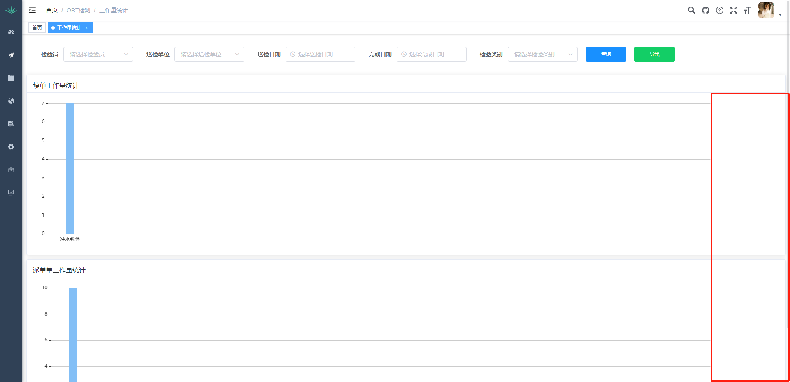

<!--
 * @Author: mengkun822 1197235402@qq.com
 * @Date: 2023-08-08 15:13:08
 * @LastEditors: mengkun822 1197235402@qq.com
 * @LastEditTime: 2023-08-08 15:43:57
 * @FilePath: \knowledge_planet\docs\md\echarts\echarts.md
 * @Description: 这是默认设置,请设置`customMade`, 打开koroFileHeader查看配置 进行设置: https://github.com/OBKoro1/koro1FileHeader/wiki/%E9%85%8D%E7%BD%AE
-->

> ### 图表根据 div 容器宽度变化

相信大家都遇到过这样的问题，在开发过程中，我们给图表的宽度是固定的，当浏览器宽度发生变化或者当 echarts 容器宽度发生变化时，图表的宽度不会随之变化，导致图表显示不全或者出现空白现象。



那该怎么去解决这个 bug 呢？我在网上查阅了很多资料，主要由两种解决办法：

1. 监听浏览器窗口大小变化，当浏览器窗口大小变化时，重新设置图表的宽度。

```js
window.addEventListener('resize', function () {
    myChart.resize();
});
```

当开启 F12 或关闭 F12 的这个写法确实可以让图表跟随浏览器窗口大小变化，但是当浏览器窗口大小变化时，图表会重新渲染。但是，如果只是展开或者收起左边菜单栏的时候，图表并不会重新渲染，导致图表宽度不变，还是会有空白情况。

2. 使用 element-resize-detector 插件实现。

```js
let elementResizeDetectorMaker = require("element-resize-detector")

let erd = elementResizeDetectorMaker();
erd.listenTo(document.getElementById("bar") , (element) => this.$nextTick( () =>
//微echarts尺寸重号
this.myEcharts.resize();
)
```

上面的代码并不完备，当监听到容器宽度变化的时候，它不断去执行 myEcharts.resize()，导致页面卡顿，解决办法是给 myCharts.resize()函数添加防抖

3. 自己写一个监听当前容器宽度的方法，当容器宽度发生变化时，重新设置图表的宽度。(推荐)

```js
import * as echarts from 'echarts';
import { debounce } from 'xe-utils';

export function resizeEcharts(dom) {
    const divElement = document.getElementById(dom);

    // 创建 ResizeObserver 实例
    const resizeObserver = new ResizeObserver((entries) => {
        for (let entry of entries) {
            // const { target, contentRect } = entry;
            // const { width } = contentRect;
            // // 处理宽度变化的逻辑
            // console.log('Div 宽度变为：' + width + 'px', target.id);
            debounce(resize(divElement), 1000);
        }
    });

    if (divElement) {
        // 开始监听
        resizeObserver.observe(divElement);
    } else {
        console.error('找不到指定的 div 元素');
    }
}

function resize(divElement) {
    const myChart = divElement && echarts.init(divElement);
    myChart && myChart.resize();
}
```

> ### 效果
>
> 
