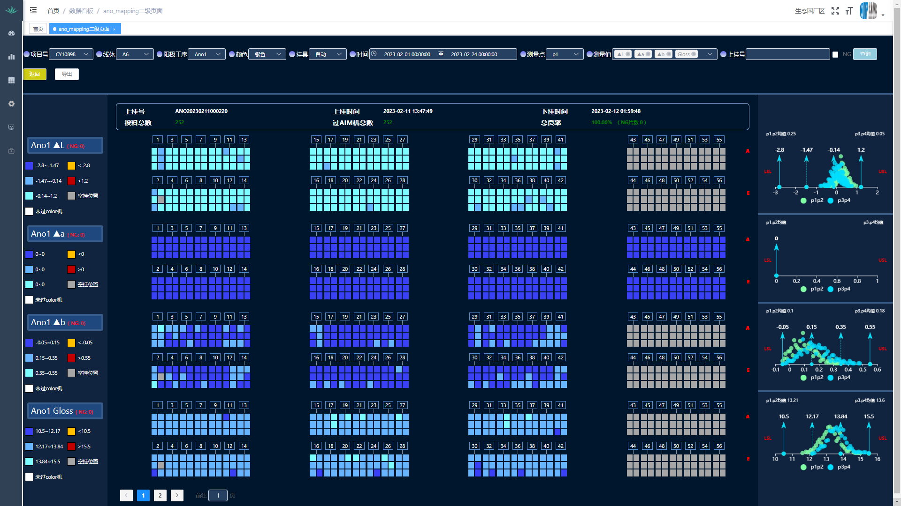
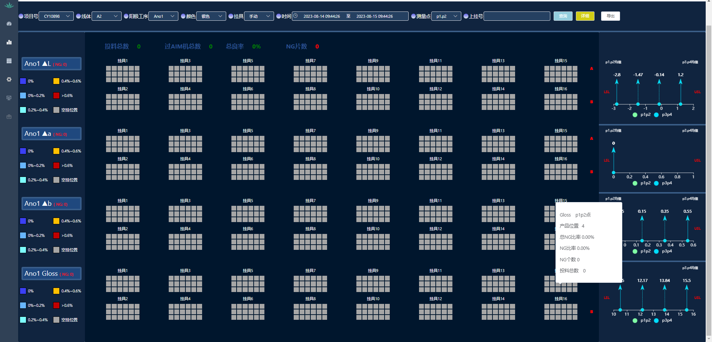

<!--
 * @Author: mengkun822 1197235402@qq.com
 * @Date: 2023-08-15 09:02:49
 * @LastEditors: mengkun822 1197235402@qq.com
 * @LastEditTime: 2023-08-15 09:55:41
 * @FilePath: \knowledge_planet\docs\md\工作案例\ano mapping.md
 * @Description: 这是默认设置,请设置`customMade`, 打开koroFileHeader查看配置 进行设置: https://github.com/OBKoro1/koro1FileHeader/wiki/%E9%85%8D%E7%BD%AE
-->

> ### Ano Mapping 看板

ano mapping 是一个看板，用于展示一杆飞杆号在 L、A、B、Gloss 四个测量值下 NG 良率的分布位置和分布状态

每根飞杆号有 A、B 两面，

-   自动化挂具：总共挂载 8 片料，每一片料上面有 7 个挂具，每个挂具上面 6 个产品（Mac 金属外壳）

-   手动化挂具：总共挂载 16 个挂具，每个挂具上面挂载 18 个产品（Mac 金属外壳）

