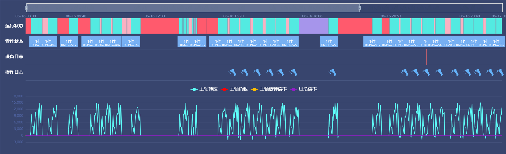

<!--
 * @Author: mengkun822 1197235402@qq.com
 * @Date: 2023-07-01 11:40:34
 * @LastEditors: mengkun822 1197235402@qq.com
 * @LastEditTime: 2023-07-01 12:31:48
 * @FilePath: \knowledge_planet\docs\md\工作案例\甘特图.md
 * @Description: 这是默认设置,请设置`customMade`, 打开koroFileHeader查看配置 进行设置: https://github.com/OBKoro1/koro1FileHeader/wiki/%E9%85%8D%E7%BD%AE
-->

> ### 甘特图

先上效果图


> ### 核心代码



思路：

首先将这个图表进行拆分为上半部分的甘特图和下半部分的折线图，这个页面的主要难点在于上半部分的甘特图。

其实上半部分的甘特图可以进行拆分为运行状态、零件状态、设备日志、操作日志等四个图表组合而成。

话不多说，直接上代码

-   初始化

```js
// initGattChartData.js 初始化配置图表
import { formatDate } from './formatDate.js';
import { initLineData } from './initLineChartData.js';
import * as echarts from 'echarts';
import { initOperateLogData } from './initOperateLogChartData';
import { initDeviceLogData } from './initDeviceLogChartData.js';
import { initPartsStatusData } from './initPartsStatusChartData';
import { initWorkStatusData } from './initWorkStatusChartData.js';

async function initOption(
    workStatusData,
    deviceLogData,
    operateLogData,
    spindleLineChartData,
    dateRange,
    deviceTipsInfo,
    isFromPartsTrace = false
) {
    const categories = ['操作日志', '设备日志', '零件状态', '运行状态'];
    const lineConfig = await initLineData(spindleLineChartData);
    const workStatusConfig = await initWorkStatusData(
        workStatusData,
        echarts,
        deviceTipsInfo
    );
    const deviceLogConfig = initDeviceLogData(
        deviceLogData,
        echarts,
        deviceTipsInfo
    );

    const operateLogConfig = [
        initOperateLogData(
            operateLogData.bindingRecordList,
            echarts,
            1,
            deviceTipsInfo
        ),
        initOperateLogData(
            operateLogData.toolRecycleList,
            echarts,
            0,
            deviceTipsInfo
        ),
    ];

    const partsStatusConfig = initPartsStatusData(
        workStatusData,
        echarts,
        deviceTipsInfo
    );
    const xAxisMaxVal =
        new Date(dateRange[1]).getTime() > Date.now()
            ? Date.now()
            : new Date(dateRange[1]).getTime();
    return {
        backgroundColor: isFromPartsTrace ? '' : 'rgb(56,69,110)',
        color: ['#5DFEF8', '#FF0000', '#FFBF00', '#921DC7'],
        tooltip: {
            show: true,
            trigger: 'axis',
        },
        grid: [
            {
                top: '60%',
                left: '5%',
                right: '1%',
            },
            {
                bottom: '50%',
                left: '5%',
                right: '1%',
            },
        ],
        legend: [
            {
                show: false,
            },
            {
                data: ['主轴转速', '主轴负载', '主轴旋转倍率', '进给倍率'],
                top: isFromPartsTrace ? '310' : '285',
                textStyle: {
                    color: isFromPartsTrace ? '#000' : '#fff',
                    fontSize: '15',
                },
            },
        ],
        dataZoom: [
            {
                type: 'inside',
                show: true,
                filterMode: 'weakFilter',
                showDataShadow: true,
                height: 10,
                borderColor: 'transparent',
                backgroundColor: '#e2e2e2',
                handleIcon:
                    'M10.7,11.9H9.3c-4.9,0.3-8.8,4.4-8.8,9.4c0,5,3.9,9.1,8.8,9.4h1.3c4.9-0.3,8.8-4.4,8.8-9.4C19.5,16.3,15.6,12.2,10.7,11.9z M13.3,24.4H6.7v-1.2h6.6z M13.3,22H6.7v-1.2h6.6z M13.3,19.6H6.7v-1.2h6.6z',
                handleSize: 20,
                handleStyle: {
                    shadowBlur: 6,
                    shadowOffsetX: 1,
                    shadowOffsetY: 2,
                    shadowColor: '#aaa',
                },
                xAxisIndex: [0, 1],
                labelFormatter: '',
                start: 0,
                end: 70,
            },
            {
                top: '10px',
                type: 'slider',
                filterMode: 'weakFilter',
            },
        ],
        xAxis: [
            {
                type: 'category',
                boundaryGap: false,
                show: false,
                splitLine: {
                    show: false,
                },
                data: lineConfig.lineXAxisData,
            },
            {
                gridIndex: 1,
                min: new Date(dateRange[0]).getTime(),
                max: xAxisMaxVal,
                scale: true,
                axisLabel: {
                    margin: -10,
                    padding: 10,
                    show: true,
                    formatter: (value) => {
                        return formatDate(value, 'mm-dd hh:mm');
                    },
                },
                position: 'top',
                splitLine: {
                    show: false,
                },
                axisTick: {
                    show: false,
                },
                axisLine: {
                    show: false,
                    lineStyle: {
                        color: '#889fcc',
                    },
                },
            },
        ],
        yAxis: [
            {
                type: 'value',
                axisPointer: {
                    snap: true,
                },
                axisTick: {
                    show: false,
                },
                axisLabel: {
                    show: true,
                    color: isFromPartsTrace ? '' : '#5064A4',
                },
                axisLine: {
                    show: false,
                },
                splitLine: {
                    show: true,
                    lineStyle: {
                        color: '#43507A',
                    },
                },
            },
            {
                gridIndex: 1,
                data: categories,
                axisLine: {
                    show: false,
                    lineStyle: {
                        color: '#889fcc',
                    },
                },
                axisTick: {
                    show: false,
                },
                axisLabel: {
                    fontSize: isFromPartsTrace ? 9 : 15,
                    fontWeight: 'bold',
                    color: isFromPartsTrace ? '' : '#fff',
                },
                splitLine: {
                    show: true,
                    lineStyle: {
                        color: 'rgba(136, 159, 204, .2)',
                    },
                },
            },
        ],
        series: [
            ...lineConfig.lineSeriesData,
            ...workStatusConfig,
            deviceLogConfig,
            ...operateLogConfig,
            partsStatusConfig,
        ],
    };
}

export { initOption };
```

-   折线图

```js
// initLineChartData.js
function initLineData(spindleLineChartData) {
    return new Promise((resolve, reject) => {
        const lineConfig = [
            { name: '主轴转速', color: '#5DFEF8', key: 'mainSpeed' },
            { name: '主轴负载', color: '#FF0000', key: 'mainOverload' },
            {
                name: '主轴旋转倍率',
                color: '#FFBF00',
                key: 'mainRotationRatio',
            },
            { name: '进给倍率', color: '#921DC7', key: 'feedRatio' },
        ];
        const lineSeriesData = [];
        const lineXAxisData = [];
        lineConfig.forEach((lineItem, lineIndex) => {
            const data = [];
            spindleLineChartData.forEach((item) => {
                if (!lineIndex) lineXAxisData.push(item.time.slice(0, 16));
                data.push(item[lineItem.key] || 0);
            });
            const lineObj = {
                symbol: 'none',
                name: lineItem.name,
                type: 'line',
                data,
                lineStyle: { color: lineItem.color },
                tooltip: {
                    axisPointer: { type: 'line', axis: 'x' },
                },
            };

            lineSeriesData.push(lineObj);
        });
        resolve({ lineXAxisData, lineSeriesData });
    });
}

export { initLineData };
```

-   设备状态

```js
// initWorkStatusChartData.js

import globalConfig from '@/utils/config';

function initWorkStatusData(workStatusData, echarts, deviceTipsInfo) {
    const referObj = {};
    const dataArr = [];
    workStatusData.forEach((item) => {
        item = {
            ...item,
            name: globalConfig.colorValue[item.state].name,
            value: [
                3,
                new Date(item.startTime).getTime(),
                new Date(item.endTime).getTime(),
            ],
            tooltip: {
                show: true,
            },
        };
        if (referObj[item.state]) {
            referObj[item.state].data.push(item);
        } else {
            referObj[item.state] = { data: [item] };
        }
    });
    Object.keys(globalConfig.colorValue).forEach((colorKey) => {
        const obj = {
            xAxisIndex: 1,
            yAxisIndex: 1,
            type: 'custom',
            renderItem: function (params, api) {
                const categoryIndex = api.value(0);
                const start = api.coord([api.value(1), categoryIndex]);
                const end = api.coord([api.value(2), categoryIndex]);
                const height = api.size([0, 1])[1] * 1;
                const rectShape = echarts.graphic.clipRectByRect(
                    {
                        x: start[0],
                        y: start[1] - height / 2,
                        width: end[0] - start[0],
                        height,
                    },
                    {
                        x: params.coordSys.x,
                        y: params.coordSys.y,
                        width: params.coordSys.width,
                        height: params.coordSys.height,
                    }
                );
                return (
                    rectShape && {
                        type: 'rect',
                        shape: rectShape,
                        style: api.style(),
                    }
                );
            },
            encode: {
                x: [1, 2],
                y: 0,
            },
            itemStyle: {
                normal: {
                    color: globalConfig.colorValue[colorKey].color,
                },
            },
            tooltip: {
                show: true,
                trigger: 'item',
                formatter: function (params) {
                    return (
                        '</br>' +
                        `${
                            params.name === '计划内停机' ||
                            params.name === '计划外停机'
                                ? `${params.data.startTime}~${params.data.endTime} </br>`
                                : ''
                        }` +
                        `${
                            params.name === '计划内停机' ||
                            params.name === '计划外停机'
                                ? '停机原因：'
                                : ''
                        }` +
                        `${
                            params.name === '计划内停机' ||
                            params.name === '计划外停机'
                                ? params.data.reasonName ||
                                  '无' + '</br>' + '</br>'
                                : ''
                        }` +
                        `${params.data.startTime}` +
                        '</br>' +
                        `状态: ${params.name}` +
                        '</br>' +
                        `运行程序: ${deviceTipsInfo?.program}` +
                        '</br>' +
                        `零件名: ${deviceTipsInfo?.partsName}` +
                        '</br>' +
                        `任务名: ${deviceTipsInfo?.jobName}` +
                        '</br>' +
                        '</br>'
                    );
                },
            },
            data: referObj[colorKey] ? referObj[colorKey].data : [],
        };
        dataArr.push(obj);
    });
    return dataArr;
}

export { initWorkStatusData };
```

-   零件状态

```js
import { formatSeconds } from '@/utils/common';
function initPartsStatusData(data, echarts, deviceTipsInfo) {
    const partsData = formatData(data);
    const partsStatusObj = {
        xAxisIndex: 1,
        yAxisIndex: 1,
        type: 'line',
        data: [],
        markPoint: {
            symbolSize: [60, 37],
            symbolOffset: [0, 0],
            silent: true,
            symbol: 'roundRect',
            itemStyle: {
                color: '#77B0F3',
            },
            label: {
                normal: {
                    formatter: function (param) {
                        return (
                            (param.data.hasIllegalCount
                                ? '{hasIllegalCount|!}'
                                : '') +
                            '{count|' +
                            param.data.completeNumber +
                            '件}' +
                            '\n{activeDuration|' +
                            formatSeconds(param.data.runTime, 'one') +
                            '}'
                        );
                    },
                    color: '#fff',
                    fontSize: 10,
                    offset: [0, 6],
                    align: 'center',
                    rich: {
                        count: {
                            color: '#fff',
                            fontSize: 13,
                        },
                        hasIllegalCount: {
                            padding: [0, 3, 0, 0],
                            color: '#FC5A5A',
                        },
                    },
                },
            },
            data: partsData,
        },
        tooltip: {
            show: true,
            trigger: 'item',
            formatter: function (params) {
                return (
                    '</br>' +
                    `${params.data.startTime}` +
                    '</br>' +
                    `状态: ${params.name}` +
                    '</br>' +
                    `运行程序: ${deviceTipsInfo?.program}` +
                    '</br>' +
                    `零件名: ${deviceTipsInfo?.partsName}` +
                    '</br>' +
                    `任务名: ${deviceTipsInfo?.jobName}` +
                    '</br>'
                );
            },
        },
    };
    return partsStatusObj;
}

function formatData(data) {
    const partsData = [];
    data.forEach((item) => {
        if (item.completeNumber) {
            const obj = {
                ...item,
                coord: [new Date(item.startTime).getTime(), 2.4],
                symbolRotate: 180,
                symbol: () => require('../../../../assets/images/tip-blue.svg'),
            };
            partsData.push(obj);
        }
    });
    return partsData;
}
export { initPartsStatusData };
```

-   设备日志

```js
// initDeviceLogChartData.js
function initDeviceLogData(data, echarts, deviceTipsInfo) {
    data = data.map((item) => {
        item = {
            ...item,
            name: '设备日志',
            value: [
                1,
                new Date(item.startTime).getTime(),
                new Date(item.endTime).getTime(),
            ],
        };
        return item;
    });
    const deviceLogObj = {
        xAxisIndex: 1,
        yAxisIndex: 1,
        type: 'custom',
        renderItem: function (params, api) {
            const categoryIndex = api.value(0);
            const start = api.coord([api.value(1), categoryIndex]);
            const end = api.coord([api.value(2), categoryIndex]);
            const height = api.size([0, 1])[1] * 1;
            const rectShape = echarts.graphic.clipRectByRect(
                {
                    x: start[0],
                    y: start[1] - height / 2,
                    width: end[0] - start[0],
                    height,
                },
                {
                    x: params.coordSys.x,
                    y: params.coordSys.y,
                    width: params.coordSys.width,
                    height: params.coordSys.height,
                }
            );
            return (
                rectShape && {
                    type: 'rect',
                    shape: rectShape,
                    style: api.style(),
                }
            );
        },
        encode: {
            x: [1, 2],
            y: 0,
        },
        itemStyle: {
            normal: {
                color: 'rgb(229,99,104)',
            },
        },
        tooltip: {
            show: true,
            trigger: 'item',
            formatter: function (params) {
                return (
                    '</br>' +
                    `${params.data?.startTime}~${params.data?.endTime}` +
                    '</br>' +
                    `停机原因：${params.data?.messageContent || '无'}` +
                    '</br>' +
                    `${params.data?.startTime}~${params.data?.endTime}` +
                    '</br>' +
                    `204自动打开` +
                    '</br>' +
                    `${params.data?.startTime}` +
                    '</br>' +
                    `状态: ${''}` +
                    '</br>' +
                    `运行程序: ${deviceTipsInfo?.program}` +
                    '</br>' +
                    `零件名: ${deviceTipsInfo?.partsName}` +
                    '</br>' +
                    `任务名: ${deviceTipsInfo?.jobName}` +
                    '</br>'
                );
            },
        },
        data,
    };
    return deviceLogObj;
}

export { initDeviceLogData };
```

-   操作日志

```js
// initOperateLogChartData.js

const paths = [
    'M12.2615385,8.35384615 C12.4994457,8.35384615 12.6923077,8.54670811 12.6923077,8.78461538 C12.6923077,9.02252266 12.4994457,9.21538462 12.2615385,9.21538462 L7.73846154,9.21538462 C7.50055426,9.21538462 7.30769231,9.02252266 7.30769231,8.78461538 C7.30769231,8.54670811 7.50055426,8.35384615 7.73846154,8.35384615 L12.2615385,8.35384615 Z M12.7692308,2 C13.3215155,2 13.7692308,2.44771525 13.7692308,3 L13.7692308,6.38461538 C13.7692308,6.93690013 13.3215155,7.38461538 12.7692308,7.38461538 L7.23076923,7.38461538 C6.67848448,7.38461538 6.23076923,6.93690013 6.23076923,6.38461538 L6.23,5.123 L3.43076923,5.12307692 C3.19286195,5.12307692 3,4.93021497 3,4.69230769 C3,4.45440042 3.19286195,4.26153846 3.43076923,4.26153846 L6.23,4.261 L6.23076923,3 C6.23076923,2.44771525 6.67848448,2 7.23076923,2 L12.7692308,2 Z M11.8923077,10.1846154 C12.3341355,10.1846154 12.6923077,10.5427876 12.6923077,10.9846154 L12.6923077,14.2038468 C12.6923077,14.3902794 12.6271953,14.570858 12.5082179,14.7143902 L10.6269009,16.9839762 C10.3449355,17.324134 9.84060503,17.3713083 9.50044722,17.0893429 C9.46319382,17.0584627 9.42881892,17.0242661 9.39774522,16.9871739 L7.49444683,14.7152339 C7.37380574,14.5712264 7.30769231,14.3893556 7.30769231,14.2014927 L7.30769231,10.9846154 C7.30769231,10.5427876 7.66586451,10.1846154 8.10769231,10.1846154 L11.8923077,10.1846154 Z M16.5692308,4.26153846 C16.807138,4.26153846 17,4.45440042 17,4.69230769 C17,4.93021497 16.807138,5.12307692 16.5692308,5.12307692 L13.666642,5.12307692 L13.666642,4.26153846 L16.5692308,4.26153846 Z',
    'M14.4045686,2.52532233 C15.2421364,3.69247833 14.9261736,4.83298686 14.7792076,5.0585414 C14.6322416,5.28409594 14.9261736,6.03061496 14.9261736,6.03061496 C14.9261736,6.03061496 14.9296979,6.03661832 14.9365472,6.04830755 L15.0159502,6.18413326 C15.059494,6.25874929 15.1178542,6.35893532 15.188762,6.48107483 L15.6373606,7.257975 C16.0756057,8.02085939 16.6624831,9.05376871 17.2395975,10.1042167 L17.5266078,10.6297334 C18.4757081,12.3785347 19.3243578,14.0591628 19.3392449,14.5027002 C19.37323,15.5152327 16.6472453,17.2400832 16.0543233,17.4447491 C15.4614013,17.649415 14.6825202,17.1912615 14.7792076,16.5740937 C14.8758951,15.956926 15.6675555,15.92108 15.2421364,14.9418003 C15.0561468,14.5136675 14.369461,13.1693074 13.6053661,11.7466537 L13.3619936,11.2957694 C13.2803408,11.1452586 13.198324,10.9948577 13.1164369,10.8455439 C12.6248229,10.8521237 12.2872472,10.7861174 12.1028592,10.6482232 C11.6443154,10.3053022 10.884848,9.0511013 11.0062029,8.74875883 C11.0542963,8.62893952 11.2548714,8.46011507 11.6079283,8.24228546 C11.4169358,7.94333363 11.2654332,7.73425031 11.1726261,7.65076934 C10.5735285,7.11187465 8.25495433,9.33528791 7.16835866,9.06176338 C6.08176298,8.78823884 4.70691008,6.66244806 4.79079078,5.92036068 C4.87467148,5.17827331 12.9094337,0.441842338 14.4045686,2.52532233 Z M7.30296281,10.714692 C7.38797095,10.7565285 7.45275293,10.8305791 7.48291806,10.9203941 C7.5055419,10.9877554 7.50728872,11.0598007 7.48880978,11.1273327 L7.46361306,11.1930195 L6.85445187,12.386736 C6.78618796,12.5226838 6.63896311,12.6001029 6.48826862,12.5792957 C6.44939148,12.5735564 6.41169229,12.5615938 6.37661894,12.5438672 C6.29235724,12.5014022 6.22844333,12.4271695 6.19896755,12.3375342 C6.17686072,12.2703077 6.17548672,12.1985573 6.19415892,12.1313674 L6.21948776,12.0660342 L6.82512988,10.8718231 C6.86759484,10.7875614 6.94182757,10.7236475 7.03146285,10.6941717 C7.12109814,10.664696 7.21877609,10.6720786 7.30296281,10.714692 Z M4.26197329,9.25606811 C4.35599472,9.24807691 4.4493341,9.27780765 4.52141275,9.33870554 C4.64907477,9.4480248 4.68016114,9.62826774 4.60624224,9.77143054 L4.56049333,9.83942192 L3.91517143,10.6010155 C3.83664786,10.6945791 3.71557456,10.7412571 3.59456492,10.7246204 C3.52790661,10.715268 3.46527526,10.6871764 3.41396048,10.6436151 C3.28629846,10.5342958 3.25521209,10.3540529 3.32913099,10.2108901 L3.3748799,10.1428987 L4.02020181,9.38130519 C4.08096896,9.30911627 4.16795187,9.26405932 4.26197329,9.25606811 Z M7.79449876,5.16112577 L6.56240852,5.8724734 C6.52251457,5.89550619 6.48469295,5.92195486 6.44936864,5.95152224 C6.14001078,6.21046296 6.07676571,6.65434695 6.28595531,6.98647595 L6.34978138,7.07406289 L6.85455429,7.6771178 C7.07816069,7.94426157 7.44543922,8.03201086 7.76103763,7.90579713 L7.86405505,7.85575391 L9.09614529,7.14440628 C9.13603924,7.1213735 9.17386086,7.09492482 9.20918517,7.06535744 C9.51854303,6.80641673 9.5817881,6.36253273 9.3725985,6.03040373 L9.30877244,5.94281679 L8.80399952,5.33976188 C8.55554797,5.04293547 8.12972341,4.96758373 7.79449876,5.16112577 Z M3.2575834,6.58783386 C3.33996584,6.69313215 3.3562769,6.83575793 3.29979502,6.95693711 C3.25460952,7.05388046 3.1689545,7.12397217 3.06808851,7.15049705 L2.98998162,7.16196075 L2.39661854,7.23467221 C2.36568153,7.23902052 2.33427601,7.23883789 2.30339167,7.23413005 C2.12768528,7.20815268 1.99814164,7.05643372 2.00002017,6.87882732 C2.00163034,6.72659327 2.09937169,6.59541659 2.23823511,6.54702948 L2.31083899,6.53002085 L2.90420207,6.45730939 L2.90948068,6.45805125 C3.04069003,6.43238606 3.17520097,6.48253557 3.2575834,6.58783386 Z',
];
function initOperateLogData(data, echarts, pathIndex, deviceTipsInfo) {
    const pathData = paths[pathIndex];
    data = data.map((item) => {
        item = {
            ...item,
            name: '操作日志',
            value: [
                0,
                new Date(item.createTime).getTime(),
                new Date(item.createTime).getTime(),
            ],
        };
        return item;
    });
    const operateLogObj = {
        xAxisIndex: 1,
        yAxisIndex: 1,
        type: 'custom',
        legendHoverLink: true,
        renderItem: function (params, api) {
            const categoryIndex = api.value(0);
            const start = api.coord([api.value(2), categoryIndex]);
            return {
                type: 'group',
                children: [
                    {
                        type: 'rect',
                        name: 'click_area',
                        shape: {
                            x: start[0] - 15,
                            y: start[1] - 15,
                            width: 30,
                            height: 30,
                        },
                        style: {
                            fill: 'transparent',
                        },
                    },
                    {
                        type: 'path',
                        name: 'click_area',
                        position: start,
                        shape: {
                            pathData,
                            y: -13,
                            width: 26,
                            height: 26,
                        },
                        style: {
                            fill: '#64B2F9',
                            lineWidth: 1,
                        },
                    },
                ],
            };
        },
        encode: {
            x: [1, 2],
            y: 0,
        },
        itemStyle: {
            normal: {
                color: '#67C23A',
            },
        },
        zlevel: 2,
        data,
        tooltip: {
            show: true,
            trigger: 'item',
            formatter: function (params) {
                return (
                    '</br>' +
                    `${params.data.createTime}` +
                    '</br>' +
                    `状态: ${params.name}` +
                    '</br>' +
                    `运行程序: ${deviceTipsInfo?.program}` +
                    '</br>' +
                    `零件名: ${deviceTipsInfo?.partsName}` +
                    '</br>' +
                    `任务名: ${deviceTipsInfo?.jobName}` +
                    '</br>'
                );
            },
        },
    };
    return operateLogObj;
}

export { initOperateLogData };
```

最后希望这个案例对大家有帮助
