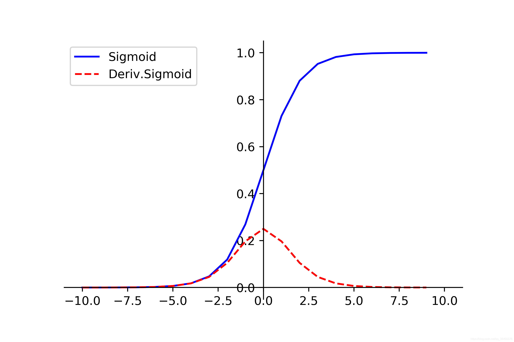
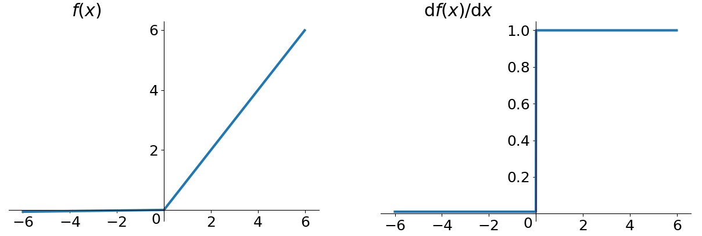
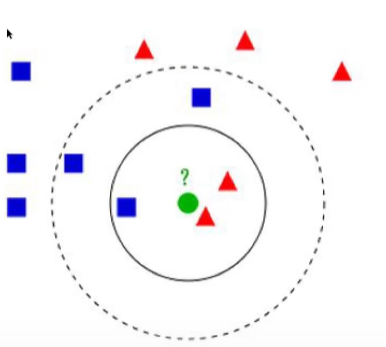

<!--
 * @Author: mengkun822 1197235402@qq.com
 * @Date: 2023-09-19 08:17:03
 * @LastEditors: mengkun822 1197235402@qq.com
 * @LastEditTime: 2023-10-11 14:28:45
 * @FilePath: \knowledge_planet\docs\md\机器学习\机器学习.md
 * @Description: 这是默认设置,请设置`customMade`, 打开koroFileHeader查看配置 进行设置: https://github.com/OBKoro1/koro1FileHeader/wiki/%E9%85%8D%E7%BD%AE
-->

> ### 深度学习

神经网络是一种基于生物神经系统的计算模型，用于模拟人脑的神经元之间的链接与信息传递。它由一系列链接的人工神经元组成，这些神经元通过加权链接形成网络，并通过输入数据进行学习与预测。

神经网络层包括输入层、隐藏层（可以多个）、输出层等组成，每个层都有多个神经元组成，输入二层接收外部数据作为输入，隐藏层负责处理和传递信息。最终在输出层给出神经玩过的预测处理。

神经网络的核心是神经元，它模拟了生物神经元的功能。每个神经元接收来自上一层神经元的输入，并通过一个激活函数对输入的进行加权和处理，产生一个输出信号，这个输出信号会传递到下层神经元，作为其输入。神经元之间的连接具有不同的权重，用于刁姐信息传递中的重要性。

训练神经网络是指根据已知的输入数据和对应的输出结果来调整神经网络中的各个连接权重，以使得网络能够精准的预测位置输入数据的输入结果。通常的训练方法有方向传播和正向传播梯度算法等。

神经网络具有强大的模块识别和学习能力，广泛用于图像识别，语音处理、自然语言处理、预测分析和控制系统等领域；

> ### 机器学习流程

1. 数据抓取

2. 特征提取（重要）

3. 建立模型

4. 评估与应用

输入层 => 卷积层 => 池化层 => 全连接层 => 输出层

> ### 特征提取的作用

-   数据特征决定了模型的上限

> ### 损失函数

损失函数是指在机器学习和统计学中使用一个函数，用于评估模型预测结果与真实标签之间的差异或错误程度

损失函数 = 损失数据 + 正则化惩罚项

正则化惩罚项力度越小，结果就会越好

> ### 前向传播

是神经网络中的一种计算过程，用于将输入数据通过网络的各层得到的结果

> ### 反向传播

反向传播是一种通过计算梯度来更新神经网络参数的方法，用于训练神经网络模型

在神经网络的训练中，目标是通过优化模型的参数使其能够最小化损失函数的值。反向传播是一种基于梯度下降的优化算法，通过计算损失函数对于网络参数的梯度，来调整参数以减小预测结果与真实值标签之间的误差。

链式法则： 是微积分中的一种重要规则， 用于计算复合函数的导数，在神经网络的反向传播算法中，从后往前一步一步去做

加法门单元： 均等分配

max 门单元： 给最大的

乘法门单元： 互换的感觉

### 激活函数

-   sigmoid 函数

是一种常用的激活函数，表达式为 σ(z) = 1 / (1 + e^(-z))

其中 e 是自然对数的底数，z 是一个实数。sigmoid 函数将任意实数映射到区间（0，1）内

特点是：

1. s 型曲线
2. 输出有界（0,1）
3. 可导性

-   Relu 函数

也是一种常用的激活函数，它在神经王阔和深度学习中广泛被应用。

公式：f(x) =manx(0, x)

其中 x 是输入，f(x)是输出

特点：

1. 非线性

2. 稀疏激活：当输入小于等于 0 的时候,Relu 输出为 0

> ### CNN（卷积神经网络）

卷积神经网络是网络的核心组成部分之一，卷积层通过应用多个卷积核在输入数据进行卷积运算，从而提取出输入数据中的特征。这些卷积核实际上是一些权重的集合，生成出特征图

> ### 回归森林

回归森林是一种机器学习，它是随机森林在回归问题上的一个变体。随机森林是一种集成学习，由多个决策树组成，每个决策树都是独立训练的

回归森林通过对训练数据集进行随机抽样和随机特征固件每个决策树，在每个决策树中，根据选定的特征和阈值对输入数据进行划分，直到达预定义的停止条件。而在回归森林中，每个叶子节点存储的不是类别标签，而不是一个实数值，用于回归预测。

在预测阶段，回归森林通过输入数据沿着每个决策树路径进行下行，并计算叶子节点中存储的数据值的平均值或加权平均值来得到最终的回归预测结果，这样，回归森林可以用于解决连续目标变量的回归问题，如房价预测、用于回归预测。

回归森林具有以下有点：

-   能够适用于高维数据和大规模数据集，处理能力强

-   能够处理非线性关系，并不需要对特征进行归一化和标准化

-   对于缺失数据和异常值具有一定的鲁捧性

    -   鲁捧性是指一个系统或算法对于异常情况、干扰和噪声的抵挡力。鲁捧性指模型对数据中不完美、错误或异常的容忍度

-   可以评估特征的重要性，用于特征选择和解释模型

总而言之， 回归森林是一个强大的回归算法，通过组合多个决策树来实现回归测试，具有较高的准确性和鲁捧性。

#### 过拟合

过拟合是指机器学习或者统计建模的过程中模型过于复杂，以至于在训练数据上表现优异，但未见过的新数据上表现比较差的现象。

当一个模型过度的适应训练数据的噪音或随机性时，它可能会过拟合，过拟合通常会发生在具有大量参数或者复杂度很高的模型，过拟合的模型可能会记住训练数据中的细节和噪音，并且无法对未知数据进行泛华

-   train_acc: 训练准确率

-   val_acc: 验证准确率

-   train_loss: 训练损失

-   val_loss: 验证损失

INIT_LR: 常用于深度学习，表示初始学习率（initial Learning Rate）

##### DropOut

是一种常用的正则化技术，用于减轻神经网络中过拟合的问题

#### 整体架构

输入层 => 卷积层 => 池化层

-   VGG（深度卷积神经网络）3\*3

-   Resnet（残差神经网络）

-   RNN（递归神经网络）

-   LSTM（长短期记忆网络）是一种循环神经网络的变体，用于处理序列数据和事件序列数据的建模和预测任务，

-   损失函数：是用来衡量模型预测值与真实之间差异的函数，在机器学习和深度学习中，通过最小化损失函数来优化模型，使其能够更快的过拟合数据和进行准确预测。常见的损失函数有：

    -   均方误差（MSE）：适用于回归问题， 计算预测值于真实值的均方差，常用线性回归和神经网络等

    -   准确率和召回率精确率衡量模型判断为正例的比例

数据清洗：在数据分析和机器学习或者深度学习中，对原始数据进行处理和筛选，以除去无效、错误或冗余的数据，从而得到高质量的、干净的数据集，数据清洗的目的是为了提高后续分析或建模的准确性和可靠性。

1. 缺失值处理

2. 异常值处理

3. 重复值处理

4. 数据类型转换：将数据转换成正确的数据类型，例如将字符转为数值型数据

5. 噪声数据处理：识别并处理数据中的噪声，可以使用平滑技术或滤波方式进行处理。

6. 格式统一化

7. 特征选择：根据任务需求悬着最相关的和最具有预测能力的特征，除去无用的特征

#### 自然语言处理

-   词向量模型-Word2Vec

-   收集数据并给定标签

-   训练一个分类器

-   测试 、评估

#### K 近邻算法

k 邻算法流程：

计算一直类别数据集中的点和当前的点的距离

但是 k 近邻算法不适用于图片识别

> ### 卷积神经网络

##### 整体架构

输入层 => 卷积层 => 池化层 => 全连接层

输入层：是神经网络的第一层，用于输入数据，在卷积神经网络中，

输入层通常由图片像素组成，

卷积层和池化层通常由滤波器和池化核组成，

全连接层通常由神经元组成，

输出层通常由分类器组成。

##### 卷积层涉及参数（conv）

-   filter_size：卷积核的尺寸

-   stride：卷积核在输入图像上移动的步长

-   padding：是否在输入图像上进行零填充

-   num_filters：卷积核的数量

##### 卷积结果计算公式

长度：H2 = (H1 - F + 2P) / S + 1

宽度：W2 = (W1 - F + 2P) / S + 1

##### 池化层涉及参数(压缩)

max Pooling 最大池化（表现最优异）

average Pooling 平均池化

##### 卷积神经网络

要经过两次卷积一次池化的周期

##### 全连接层

只有带参数计算的才能称为层

全连接层得到结果

##### 经典的网络架构

-   Alexnet

-   VGG 3\*3

-   GoogLeNet

-   ResNet

> ### 语义分割

-   U-net

-   主要网络结构

-   还引入了特征拼接操作

-   以前我们都是加法，现在全部都要

-   把能够拼凑的都拼凑起来

-   U-net++

整体网络结构

特征融合，拼接更全面

其实和 densenet 思想一致

损失由多个位置计算，在更新

现在来看很多视觉任务都可以套用这招

更容易剪枝

因为前面也可以单独有监督训练

可以根据速度要求来快速完成剪枝

训练的时候同样会用到 L4，效果还不错

Down-Sampling : 是一种常用的图像处理和计算机视觉领域中的操作，用于将图像或特征图的尺寸缩小。在深度学习中，Down-Sampling 通常通过卷积、池化等操作来实现的，这些操作可以实现减小特征图的尺寸并提取更高级别的特征信息。

Up-Sampling: 用于将图片或者特征图的尺寸放大

Skip-Connection:也被成为跳跃连接，是深度学习中的一种重要技术。解决了深层神经网络训练过程中的梯度消失问题。

Convolution:卷积操作，用于图片的特征提取

iou: 交并比是用于评估目标检测模型性能的指标，其计算公式如下：

iou = 交集 / 并集

显著目标监测(Salient Object Detection)有 U2- net

显著目标检测的方法和原理：

1. 颜色对比：

2. 亮度对比

3. 空间注意力模型：

4. 图像和分割

应用领域： 图像编辑、广告设计、目标跟踪、边缘检测等任务，以调高相关算法的性能和效果。

SPP-Layer: 是一种在卷积神经网络中常用的特征池化技术，指在解决输入图像大小不一致的问题。spp 层可以在卷积神经网络的最后一层卷积层与全连接层之间插入，用于将任意大小的特征图转换为固定长度的特征向量。

ASPP:ASPP 进一步拓展了 SPP 的方法，针对语义化分割任务进行优化。

deppLabV3+:是一种基于深度学习的语义分割神经网络模型，是deepLab系列的升级版本，它使用了ASPP层和空洞层可分离卷积等现代网络结构，并对编码器解码器架构进行了改进，以提高分割精度和运行速度。
